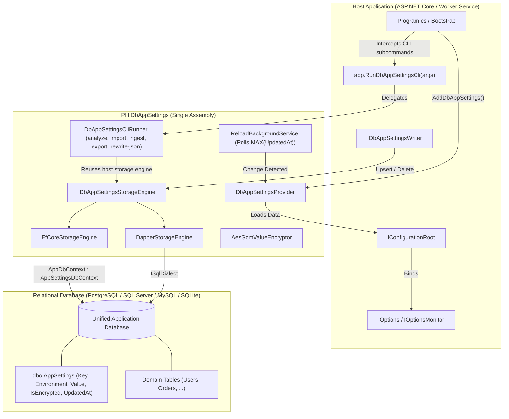

# PH.DbAppSettings

[](https://dotnet.microsoft.com/)
[](LICENSE)
[-brightgreen.svg)](#testing--quality)

A high-performance .NET 10 configuration provider library that replaces `appsettings.json` in production by persisting configuration settings in relational databases using either **Entity Framework Core 10** or **Dapper**, featuring a unified embedded In-App CLI engine and MSBuild targets in a single NuGet package.

`PH.DbAppSettings` integrates directly into the Microsoft Configuration system as a native `ConfigurationProvider`, providing seamless support for `IOptions<T>`, `IOptionsSnapshot<T>`, `IOptionsMonitor<T>`, $O(1)$ timestamp change detection, AES-GCM 256-bit encryption at rest, and embedded CLI commands without secondary tool dependencies.

---

## Key Features

- **Single Package & Unified Codebase**: 100% of runtime configuration, storage engines, and CLI tools are packaged directly in `PH.DbAppSettings`.
- **Co-located Application Database (EF Core 10)**: Inherit `AppSettingsDbContext<TContext>` directly in your application's `DbContext` to keep settings alongside your domain tables without separate databases or connection pools.
- **Dual Engine Support**: Choose between **Entity Framework Core 10** and ultra-fast **Dapper** micro-ORM in the same assembly.
- **Multi-Provider Relational Support**: Works out-of-the-box with **PostgreSQL** (`Npgsql`), **SQL Server** (`Microsoft.Data.SqlClient`), **MySQL / MariaDB** (`Pomelo`), and **SQLite**.
- **Embedded In-App CLI Runner**: Run CLI commands directly via your application (`dotnet run -- dbappsettings ...` or `dotnet MyApp.dll dbappsettings ...`) with automatic detection of your database connection and dialect.
- **Native Microsoft Options Binding**: Full compatibility with `IOptions<T>`, `IOptionsSnapshot<T>`, and `IOptionsMonitor<T>`. Keys are automatically normalized between `:` (Options standard) and `__` (database/environment standard).
- **$O(1)$ Timestamp Change Detection**: Real-time configuration reloading is detected by querying `MAX(UpdatedAt)` on the database table instead of performing expensive full-table diffs.
- **Design-Time Migrations**: Includes `AppSettingsDesignTimeDbContextFactory<TContext>` to streamline `dotnet ef migrations add` in host projects.
- **At-Rest Encryption**: Optional authenticated AES-GCM 256-bit encryption for sensitive configuration values.

---

## Architecture Overview



---

## Installation

Install the single package into your project:

```bash
dotnet add package PH.DbAppSettings
```

---

## Quick Start & Usage

### 1. Using Entity Framework Core 10 (Co-located Application Database)

#### Step 1: Inherit `AppSettingsDbContext` in your application `DbContext`

```csharp
using Microsoft.EntityFrameworkCore;
using PH.DbAppSettings.Data;

namespace MyApp.Data;

public class AppDbContext(DbContextOptions<AppDbContext> options) 
    : AppSettingsDbContext<AppDbContext>(options)
{
    public DbSet<User> Users => Set<User>();
    public DbSet<Product> Products => Set<Product>();

    protected override void OnModelCreating(ModelBuilder modelBuilder)
    {
        base.OnModelCreating(modelBuilder); // Configures AppSettingEntry mapping
        
        // Your application entity configurations:
        modelBuilder.ApplyConfigurationsFromAssembly(typeof(AppDbContext).Assembly);
    }
}
```

#### Step 2: Configure `Program.cs` with In-App CLI Interceptor

```csharp
using Microsoft.EntityFrameworkCore;
using MyApp.Data;
using PH.DbAppSettings;

var builder = WebApplication.CreateBuilder(args);

// 1. Bootstrap config (reads DB connection string from env var or local appsettings.json)
var bootstrapConfig = new ConfigurationBuilder()
    .AddEnvironmentVariables()
    .AddJsonFile("appsettings.json", optional: true)
    .Build();

var connectionString = bootstrapConfig.GetConnectionString("DefaultConnection") 
    ?? "Host=localhost;Database=MyAppDb;Username=postgres;Password=secret;";

// 2. Add DbAppSettings provider for EF Core
builder.Configuration.AddDbAppSettings<AppDbContext>(bootstrapConfig, options =>
{
    options.ConnectionString = connectionString;
    options.UseEntityFramework<AppDbContext>((opts, conn) => opts.UseNpgsql(conn));
    
    options.AutoMigrate = true;     // Ensures schema is initialized
    options.UseMigrations = true;   // Executes context.Database.MigrateAsync()
    options.SeedOnEmpty = true;     // Seeds settings from bootstrap config if table is empty
    options.ReloadInterval = TimeSpan.FromSeconds(30); // Automatic $O(1)$ change detection
});

// 3. Register DbContext and DbAppSettings services in DI
builder.Services.AddDbContext<AppDbContext>(opts => opts.UseNpgsql(connectionString));

builder.Services.AddDbAppSettingsServices<AppDbContext>(options =>
{
    options.UseEntityFramework<AppDbContext>((opts, conn) => opts.UseNpgsql(conn));
    options.ReloadInterval = TimeSpan.FromSeconds(30);
});

// 4. Strongly typed Options binding
builder.Services.Configure<SmtpOptions>(builder.Configuration.GetSection("Smtp"));
builder.Services.Configure<FeatureFlags>(builder.Configuration.GetSection("Features"));

var app = builder.Build();

// 5. In-App CLI interceptor (handles CLI commands when invoked via 'dotnet run -- dbappsettings ...')
if (app.RunDbAppSettingsCli(args)) return;

app.Run();
```

#### Step 3: Support EF Core Design-Time Migrations (`dotnet ef migrations`)

Create a factory in your project inheriting `AppSettingsDesignTimeDbContextFactory<TContext>`:

```csharp
using Microsoft.EntityFrameworkCore;
using PH.DbAppSettings.Data;

namespace MyApp.Data;

public sealed class AppDbContextFactory : AppSettingsDesignTimeDbContextFactory<AppDbContext>
{
    protected override void ConfigureOptionsBuilder(
        DbContextOptionsBuilder<AppDbContext> builder, 
        string connectionString)
    {
        builder.UseNpgsql(connectionString);
    }
}
```

Now you can generate and apply migrations normally:
```bash
dotnet ef migrations add AddDbAppSettings --context AppDbContext
dotnet ef database update --context AppDbContext
```

---

### 2. Using Dapper (Lightweight Micro-ORM Setup)

Ideal for microservices or background workers where an Entity Framework DbContext is not needed:

```csharp
using Npgsql;
using PH.DbAppSettings;
using PH.DbAppSettings.Storage.Dialects;

var builder = WebApplication.CreateBuilder(args);

var bootstrapConfig = new ConfigurationBuilder()
    .AddEnvironmentVariables()
    .AddJsonFile("appsettings.json", optional: true)
    .Build();

var connectionString = bootstrapConfig.GetConnectionString("DefaultConnection")!;

builder.Configuration.AddDbAppSettings(bootstrapConfig, options =>
{
    options.ConnectionString = connectionString;
    options.UseDapper(() => new NpgsqlConnection(connectionString), new PostgreSqlDialect());
    options.AutoMigrate = true;
    options.SeedOnEmpty = true;
    options.ReloadInterval = TimeSpan.FromSeconds(30);
});

builder.Services.AddDbAppSettingsServices(options =>
{
    options.UseDapper(() => new NpgsqlConnection(connectionString), new PostgreSqlDialect());
    options.ReloadInterval = TimeSpan.FromSeconds(30);
});

builder.Services.Configure<SmtpOptions>(builder.Configuration.GetSection("Smtp"));

var app = builder.Build();
if (app.RunDbAppSettingsCli(args)) return;
app.Run();
```

---

## In-App CLI Tooling (`dbappsettings`)

With `PH.DbAppSettings`, you do not need to install an external CLI tool. You can run commands directly through your application. The CLI automatically utilizes your application's configured database engine, connection string, and dialect!

### 1. Analyze `appsettings.json`
Scans JSON configuration files, displays flattened key hierarchies and value types, and flags sensitive properties (passwords, connection strings, API keys, secrets, tokens):
```bash
dotnet run -- dbappsettings analyze appsettings.json
```

### 2. Import into Database
Imports all flattened settings from an `appsettings.json` file into the target database table with automatic schema creation:
```bash
dotnet run -- dbappsettings import appsettings.json -e Production
```

### 3. Ingest and Delete Source `appsettings.json`
Imports settings into the database and safely deletes the source `appsettings.json` file to prevent credentials from lingering in production containers:
```bash
dotnet run -- dbappsettings ingest appsettings.json -e Production -y
```

### 4. Reconstruct / Rewrite JSON (`rewrite-json`)
Queries records from the database and reconstructs a fully typed (preserving booleans, numbers, arrays, and nested objects) `appsettings.json` file:
```bash
dotnet run -- dbappsettings rewrite-json appsettings.json -e Production
```

### 5. Export Database to JSON
Exports raw database entries into a JSON file:
```bash
dotnet run -- dbappsettings export appsettings.exported.json -e Production
```

### MSBuild Target Invocations
You can also run CLI tasks via MSBuild:
```bash
dotnet build /t:DbAppSettings /p:DbAppSettingsArgs="analyze appsettings.json"
```

---

## Microsoft Options Binding & Key Normalization

Keys stored in the database can use `:` or `__` interchangeably. When loaded into `IConfigurationProvider.Data`, keys are always normalized to `:` delimiter.

This guarantees that standard Microsoft options patterns work seamlessly:

```csharp
// 1. Static options (at startup)
public class EmailService(IOptions<SmtpOptions> options)
{
    private readonly SmtpOptions _options = options.Value;
}

// 2. Scoped snapshot options (per-request)
public class NotificationService(IOptionsSnapshot<SmtpOptions> options)
{
    private readonly SmtpOptions _options = options.Value;
}

// 3. Dynamic options monitor (receives real-time updates when database changes)
public class FeatureManager(IOptionsMonitor<FeatureFlags> monitor)
{
    public bool IsCacheEnabled => monitor.CurrentValue.EnableCache;
}
```

---

## Runtime Writer API

Inject `IDbAppSettingsWriter` to mutate or remove configuration entries at runtime:

```csharp
app.MapPost("/api/settings/feature", async (
    [FromBody] UpdateFeatureRequest req, 
    IDbAppSettingsWriter writer) =>
{
    await writer.SetAsync("Features:EnableCache", req.EnableCache);
    return Results.Ok();
});

app.MapDelete("/api/settings/{key}", async (
    string key, 
    IDbAppSettingsWriter writer) =>
{
    await writer.DeleteAsync(key);
    return Results.Ok();
});
```

---

## Configuration Options Reference

| Property / Method | Type | Default | Description |
| :--- | :--- | :--- | :--- |
| `ConnectionString` | `string?` | `null` | Relational database connection string. |
| `Environment` | `string` | `"Production"` | Target environment name (matches `ASPNETCORE_ENVIRONMENT`). |
| `AutoMigrate` | `bool` | `true` | Automatically initializes or migrates the database schema on startup. |
| `UseMigrations` | `bool` | `false` | When `true`, calls `context.Database.MigrateAsync()`; when `false`, calls `EnsureCreatedAsync()`. |
| `SeedOnEmpty` | `bool` | `true` | Seeds configuration from bootstrap config when the database table is empty. |
| `ForceReseed` | `bool` | `false` | Overwrites existing database entries with values from bootstrap config. |
| `ExcludeKeysFromSeed` | `IReadOnlyList<string>` | `[]` | List of keys excluded from database seeding. |
| `EncryptValues` | `bool` | `false` | Enables AES-GCM 256-bit encryption for values stored in the database. |
| `ReloadInterval` | `TimeSpan?` | `null` | Polling interval for $O(1)$ `MAX(UpdatedAt)` change detection (`null` = disabled). |
| `SchemaName` | `string` | `"dbo"` | Database schema name for the configuration table. |
| `TableName` | `string` | `"AppSettings"` | Database table name. |
| `UseEntityFramework<TContext>(...)` | `method` | - | Configures EF Core engine for derived context `TContext : AppSettingsDbContext`. |
| `UseDapper(...)` | `method` | - | Configures Dapper engine with connection factory delegate and `ISqlDialect`. |
| `UseDapperSqlite(connStr)` | `method` | - | Configures Dapper engine for SQLite. |

---

## Database Table Schema

```sql
CREATE TABLE AppSettings (
    [Key]          NVARCHAR(512)      NOT NULL,
    [Environment]  NVARCHAR(64)       NOT NULL DEFAULT 'Production',
    [Value]        NVARCHAR(MAX)      NULL,
    [IsEncrypted]  BIT                NOT NULL DEFAULT 0,
    [UpdatedAt]    DATETIMEOFFSET     NOT NULL DEFAULT SYSDATETIMEOFFSET(),
    CONSTRAINT PK_AppSettings PRIMARY KEY ([Key], [Environment])
);
```

---

## Solution Structure

```
PH.DbAppSettings/
├── src/
│   └── PH.DbAppSettings/              # Unified Core Library + In-App CLI Engine
│       ├── Configuration/             # Provider, configuration source, KeyNormalizer
│       ├── Storage/                   # IDbAppSettingsStorageEngine, EF Core, Dapper, Dialects
│       │   └── Dialects/              # SqlServer, PostgreSql, MySql, Sqlite dialects
│       ├── Data/                      # AppSettingsDbContext (abstract), DesignTimeFactory
│       ├── Encryption/                # IValueEncryptor, AesGcmValueEncryptor (AES-GCM 256-bit)
│       ├── Services/                  # Writer, SeedService, ReloadBackgroundService
│       ├── Cli/                       # Unified CLI Runner, JsonAnalyzer, TreeReconstructor
│       ├── build/                     # MSBuild targets (PH.DbAppSettings.targets)
│       ├── DbAppSettingsOptions.cs
│       ├── DbAppSettingsMutableOptions.cs
│       └── DbAppSettingsExtensions.cs
├── examples/
│   └── PH.DbAppSettings.Example.MinimalApi/ # Reference implementation with EF Core & Scalar OpenAPI
├── tests/
│   └── PH.DbAppSettings.Tests/        # 110 unit and integration tests (100% green)
├── specs/                             # Formal TDD specifications
├── reasoning/                         # Architecture analysis and decision records
└── AGENTS.md                          # Repository governance instructions
```

---

## Testing & Quality

All changes in `PH.DbAppSettings` strictly adhere to Test-Driven Development (TDD).

```bash
# Build solution
dotnet build PH.DbAppSettings.slnx

# Run all 110 unit & integration tests
dotnet test PH.DbAppSettings.slnx

# Check code format
dotnet format PH.DbAppSettings.slnx --verify-no-changes
```

---

## License

This project is licensed under the [MIT License](LICENSE).
