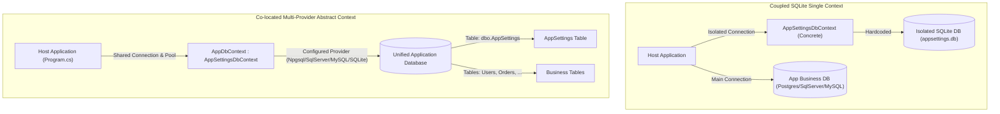
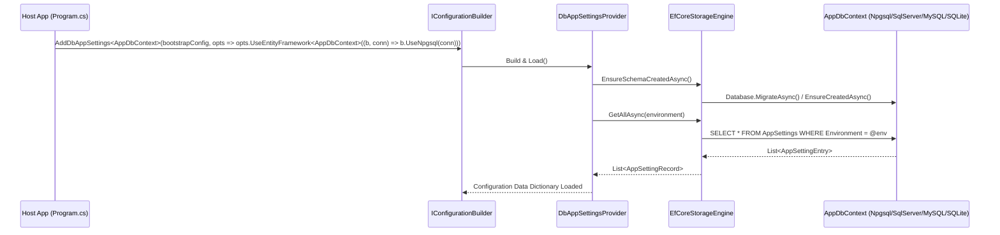

# Abstract AppSettingsDbContext and Multi-Provider Host Database Integration

## Requirements Overview

The configuration management library `PH.DbAppSettings` requires a fundamental architectural refactoring of its Entity Framework Core persistence layer (`AppSettingsDbContext` and `AppSettingsDbContextFactory`).

In production enterprise architectures, applications should not maintain multiple fragmented databases or isolated SQLite files solely for configuration storage. Instead, the database hosting the `AppSettings` configuration table must be the primary application relational database (co-location).

To achieve this:
1. `AppSettingsDbContext` must be transformed into a `public abstract` base class (`AppSettingsDbContext` and `AppSettingsDbContext<TContext>`) that host application `DbContext` classes inherit directly.
2. Hardcoded SQLite dependencies in factories and configuration providers must be eliminated.
3. The library must dynamically inherit the host application's connection string and support multiple major relational providers: PostgreSQL (via `Npgsql`), SQL Server (via `Microsoft.EntityFrameworkCore.SqlServer`), MySQL (via `Pomelo.EntityFrameworkCore.MySql`), and SQLite (via `Microsoft.EntityFrameworkCore.Sqlite`).
4. EF Core migrations must be owned by the host application's derived `DbContext`, supported by a reusable abstract design-time factory base class `AppSettingsDesignTimeDbContextFactory<TContext>`.

## Context and Architectural Problem Statement

Prior to this refactoring, `PH.DbAppSettings` implemented EF Core configuration with several tight couplings:
- `AppSettingsDbContext` was a concrete class accepting only `DbContextOptions<AppSettingsDbContext>`.
- `AppSettingsDbContextFactory` was hardcoded to create a local SQLite database `"Data Source=designtime.db"`.
- `DbAppSettingsProvider` and `ReloadBackgroundService` had fallback constructors silently instantiating SQLite contexts when no storage engine was explicitly configured.
- Host applications could not co-locate the `AppSettings` table inside their main business `DbContext` without maintaining a separate database connection or context.

This created an architectural impedance mismatch for host applications running PostgreSQL, SQL Server, or MySQL in cloud and containerized environments.



## Detailed Architectural Design

### 1. Abstract DbContext Hierarchy

`AppSettingsDbContext` is structured with dual base classes matching standard .NET patterns (such as `IdentityDbContext` in ASP.NET Core Identity):

```csharp
namespace PH.DbAppSettings.Data;

/// <summary>
/// Abstract base DbContext providing configuration storage entities and mapping.
/// Inherit this class in your application's DbContext to co-locate AppSettings in the application database.
/// </summary>
public abstract class AppSettingsDbContext : DbContext
{
    protected AppSettingsDbContext(DbContextOptions options) : base(options)
    {
    }

    protected AppSettingsDbContext() : base()
    {
    }

    public DbSet<AppSettingEntry> AppSettings => Set<AppSettingEntry>();

    protected override void OnModelCreating(ModelBuilder modelBuilder)
    {
        base.OnModelCreating(modelBuilder);
        modelBuilder.ApplyConfiguration(new AppSettingEntryConfiguration());
    }
}

/// <summary>
/// Generic abstract base DbContext for strongly typed DbContextOptions.
/// </summary>
/// <typeparam name="TContext">The derived DbContext type.</typeparam>
public abstract class AppSettingsDbContext<TContext> : AppSettingsDbContext where TContext : DbContext
{
    protected AppSettingsDbContext(DbContextOptions<TContext> options) : base(options)
    {
    }

    protected AppSettingsDbContext() : base()
    {
    }
}
```

### 2. Host Application Implementation Pattern

Host applications inherit `AppSettingsDbContext<AppDbContext>` into their primary application context:

```csharp
public sealed class AppDbContext(DbContextOptions<AppDbContext> options) 
    : AppSettingsDbContext<AppDbContext>(options)
{
    public DbSet<User> Users => Set<User>();
    public DbSet<Product> Products => Set<Product>();

    protected override void OnModelCreating(ModelBuilder modelBuilder)
    {
        base.OnModelCreating(modelBuilder); // Registers AppSettingEntry entity configuration
        
        // Host entity mappings
        modelBuilder.ApplyConfigurationsFromAssembly(typeof(AppDbContext).Assembly);
    }
}
```

### 3. Design-Time Migration Factory Helper

To support EF Core CLI tooling (`dotnet ef migrations add`), `PH.DbAppSettings` provides a base class that resolves connection strings from environment variables or local JSON files without hardcoding any provider:

```csharp
namespace PH.DbAppSettings.Data;

public abstract class AppSettingsDesignTimeDbContextFactory<TContext> : IDesignTimeDbContextFactory<TContext>
    where TContext : AppSettingsDbContext
{
    public TContext CreateDbContext(string[] args)
    {
        var connectionString = ResolveConnectionString(args);
        var optionsBuilder = new DbContextOptionsBuilder<TContext>();
        
        ConfigureOptionsBuilder(optionsBuilder, connectionString);
        
        return CreateDbContextInstance(optionsBuilder.Options);
    }

    protected abstract void ConfigureOptionsBuilder(
        DbContextOptionsBuilder<TContext> builder, 
        string connectionString);

    protected virtual TContext CreateDbContextInstance(DbContextOptions<TContext> options)
    {
        return (TContext)Activator.CreateInstance(typeof(TContext), options)!;
    }

    protected virtual string ResolveConnectionString(string[] args)
    {
        return Environment.GetEnvironmentVariable("DbAppSettings__ConnectionString")
            ?? Environment.GetEnvironmentVariable("ConnectionStrings__DefaultConnection")
            ?? "Server=localhost;Database=AppDb;Integrated Security=true;TrustServerCertificate=true;";
    }
}
```

Host applications simply derive from this helper:

```csharp
// Example in PostgreSQL host application:
public sealed class AppDbContextFactory : AppSettingsDesignTimeDbContextFactory<AppDbContext>
{
    protected override void ConfigureOptionsBuilder(DbContextOptionsBuilder<AppDbContext> builder, string connectionString)
    {
        builder.UseNpgsql(connectionString);
    }
}
```

## Multi-Provider Configuration and DI Extensions

The host application registers `PH.DbAppSettings` during bootstrap using generic configuration builder and service collection extensions:



### 1. Fluent Configuration Methods

`DbAppSettingsMutableOptions` provides provider-agnostic registration:

```csharp
// PostgreSQL
builder.Configuration.AddDbAppSettings<AppDbContext>(bootstrapConfig, options =>
{
    options.UseEntityFramework<AppDbContext>((builder, connStr) => builder.UseNpgsql(connStr));
    options.UseMigrations = true;
});

// SQL Server
builder.Configuration.AddDbAppSettings<AppDbContext>(bootstrapConfig, options =>
{
    options.UseEntityFramework<AppDbContext>((builder, connStr) => builder.UseSqlServer(connStr));
    options.UseMigrations = true;
});

// MySQL / MariaDB (Pomelo)
builder.Configuration.AddDbAppSettings<AppDbContext>(bootstrapConfig, options =>
{
    options.UseEntityFramework<AppDbContext>((builder, connStr) => 
        builder.UseMySql(connStr, ServerVersion.AutoDetect(connStr)));
    options.UseMigrations = true;
});

// SQLite
builder.Configuration.AddDbAppSettings<AppDbContext>(bootstrapConfig, options =>
{
    options.UseEntityFramework<AppDbContext>((builder, connStr) => builder.UseSqlite(connStr));
    options.UseMigrations = false;
});
```

### 2. Dependency Injection Service Registration

`DbAppSettingsExtensions.AddDbAppSettingsServices<TContext>` integrates cleanly with `IServiceCollection`:

```csharp
builder.Services.AddDbContext<AppDbContext>(options =>
{
    options.UseNpgsql(connectionString);
});

builder.Services.AddDbAppSettingsServices<AppDbContext>(options =>
{
    options.UseEntityFramework<AppDbContext>(sp => sp.GetRequiredService<AppDbContext>());
    options.ReloadInterval = TimeSpan.FromSeconds(30);
});
```

## Schema Lifecycle and Migration Execution

`EfCoreStorageEngine.EnsureSchemaCreatedAsync` dynamically switches execution modes based on `DbAppSettingsOptions.UseMigrations`:
- When `UseMigrations = false` (default for tests, local dev, or lightweight SQLite environments): Executes `await context.Database.EnsureCreatedAsync(ct)`.
- When `UseMigrations = true` (production enterprise standard with EF Core migrations): Executes `await context.Database.MigrateAsync(ct)`.

## Summary of Breaking Changes and Migration Guidelines

1. **Context Instantiation**:
   - `new AppSettingsDbContext(options)` is no longer valid. Host applications must create a concrete context class inheriting `AppSettingsDbContext` or `AppSettingsDbContext<TContext>`.
2. **Design-Time Tooling**:
   - `AppSettingsDbContextFactory` hardcoded to SQLite has been removed. Host applications manage their own migrations or inherit `AppSettingsDesignTimeDbContextFactory<TContext>`.
3. **Provider Fallbacks**:
   - Silent fallbacks to SQLite have been removed from `DbAppSettingsProvider` and `ReloadBackgroundService`. If no storage engine is supplied, a clear `InvalidOperationException` is thrown at startup.
4. **Test Harness**:
   - Internal test projects use `TestAppSettingsDbContext : AppSettingsDbContext<TestAppSettingsDbContext>`.

## Implementation Roadmap for TDD Spec Generation

The implementation is structured into 5 sequential phases for execution via `/tdd-spec-generator`:

### Phase 1: Abstract DbContext & Design-Time Base Factory
- Declare `public abstract class AppSettingsDbContext : DbContext` and generic `AppSettingsDbContext<TContext>`.
- Implement `public abstract class AppSettingsDesignTimeDbContextFactory<TContext>`.
- Remove obsolete concrete `AppSettingsDbContextFactory.cs` and old migration snapshot files in `src/PH.DbAppSettings/Data/Migrations/`.

### Phase 2: Polymorphic Storage Engine & Provider Decoupling
- Update `EfCoreStorageEngine` to support `UseMigrations` with `Database.MigrateAsync` / `Database.EnsureCreatedAsync`.
- Decouple `EfCoreStorageEngine` to work polymorphically against any derived `AppSettingsDbContext`.
- Remove `CreateDefaultEfEngine()` from `DbAppSettingsProvider.cs`.

### Phase 3: Generic Options & DI Extensions
- Add `UseMigrations` to `DbAppSettingsOptions` and `DbAppSettingsMutableOptions`.
- Add generic `UseEntityFramework<TContext>` overloads to `DbAppSettingsMutableOptions`.
- Add generic `AddDbAppSettings<TContext>` and `AddDbAppSettingsServices<TContext>` extensions to `DbAppSettingsExtensions`.
- Remove SQLite-hardcoded constructors from `ReloadBackgroundService`.

### Phase 4: Test Infrastructure & Test Suite Migration
- Create `TestAppSettingsDbContext` in `tests/PH.DbAppSettings.Tests/Helpers/TestAppSettingsDbContext.cs`.
- Update all unit and integration test fixtures (`EfCoreStorageEngineTests`, `DbAppSettingsProviderTests`, `NativeOptionsBindingTests`, `SeedServiceTests`, `TypedReadingTests`, `BootstrapIntegrationTests`).
- Add tests for `AppSettingsDesignTimeDbContextFactory`, generic `UseEntityFramework<TContext>`, and `UseMigrations` switching.

### Phase 5: Example Project and Documentation Updates
- Update `examples/PH.DbAppSettings.Example.MinimalApi` to define `AppDbContext : AppSettingsDbContext<AppDbContext>`.
- Update `README.md` and `AGENTS.md` with multi-provider setup instructions and architectural guidelines.

## Workspace References

- `src/PH.DbAppSettings/PH.DbAppSettings.csproj`
- `src/PH.DbAppSettings/DbAppSettingsExtensions.cs`
- `src/PH.DbAppSettings/DbAppSettingsOptions.cs`
- `src/PH.DbAppSettings/DbAppSettingsMutableOptions.cs`
- `src/PH.DbAppSettings/Configuration/DbAppSettingsConfigurationSource.cs`
- `src/PH.DbAppSettings/Configuration/DbAppSettingsProvider.cs`
- `src/PH.DbAppSettings/Data/AppSettingEntry.cs`
- `src/PH.DbAppSettings/Data/AppSettingEntryConfiguration.cs`
- `src/PH.DbAppSettings/Data/AppSettingsDbContext.cs`
- `src/PH.DbAppSettings/Data/AppSettingsDbContextFactory.cs`
- `src/PH.DbAppSettings/Storage/IDbAppSettingsStorageEngine.cs`
- `src/PH.DbAppSettings/Storage/EfCoreStorageEngine.cs`
- `src/PH.DbAppSettings/Services/ReloadBackgroundService.cs`
- `src/PH.DbAppSettings/Services/SeedService.cs`
- `examples/PH.DbAppSettings.Example.MinimalApi/Program.cs`
- `tests/PH.DbAppSettings.Tests/EfCoreStorageEngineTests.cs`
- `tests/PH.DbAppSettings.Tests/Helpers/DbContextHelper.cs`
- `tests/PH.DbAppSettings.Tests/DbAppSettingsProviderTests.cs`
- `tests/PH.DbAppSettings.Tests/NativeOptionsBindingTests.cs`
