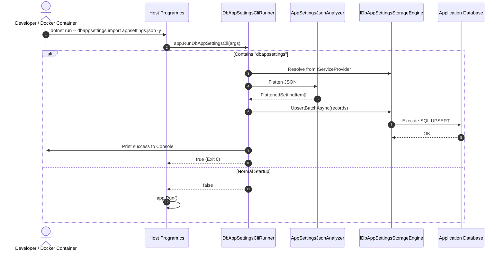

# Reasoning Summary: Unifying CLI Tooling into a Single PH.DbAppSettings Package

## Executive Summary

This reasoning session investigated the architectural feasibility, packaging mechanics, dependency impacts, and developer ergonomics of integrating the CLI tooling directly into the core `PH.DbAppSettings` package, eliminating the secondary `PH.DbAppSettings.Cli` project to distribute **strictly 1 single assembly and 1 NuGet package**.

---

## Key Findings & Decisions

1. **Packaging Mechanics & Dependency Isolation**:
   - Bundling fat database drivers (`Microsoft.Data.SqlClient`, `Npgsql`, `MySqlConnector`) and UI frameworks (`Spectre.Console`) into a library package creates severe dependency bloat and version conflicts for consuming applications.
   - By implementing an **In-App CLI Engine** (`DbAppSettingsCliRunner`) in `PH.DbAppSettings`, the CLI operates directly against the host application's DI-configured storage engine (`AppDbContext` or Dapper) with **zero additional dependencies**.
2. **In-App Invocation Model**:
   - Host applications include a clean one-line interceptor in `Program.cs`:
     ```csharp
     var app = builder.Build();
     if (app.RunDbAppSettingsCli(args)) return;
     app.Run();
     ```
   - Developers and CI/CD pipelines run:
     ```bash
     dotnet run -- dbappsettings analyze appsettings.json
     dotnet run -- dbappsettings import appsettings.json -y
     dotnet run -- dbappsettings rewrite-json -o appsettings.json
     ```
   - **Key Ergonomic Advantage**: No need to manually pass connection string (`-c`) or dialect (`-d`) flags because the host application's storage engine is already configured!
3. **MSBuild Target Support**:
   - The package bundles `build/PH.DbAppSettings.targets`, allowing direct MSBuild execution:
     ```bash
     dotnet build /t:DbAppSettings /p:DbAppSettingsArgs="analyze appsettings.json"
     ```

---

## Architectural Sequence Diagram



---

## Steps Index

- `steps/000-plan.md`
- `steps/001-nuget-and-dotnet-tool-mechanics.md`
- `steps/002-dependency-and-assembly-footprint-analysis.md`
- `steps/003-cli-invocation-models-in-consumer-projects.md`
- `steps/004-architectural-options-and-swot-matrix.md`
- `steps/qa-midpoint.md`
- `steps/005-single-package-dual-payload-verification.md`
- `steps/006-target-architectural-blueprint.md`
- `steps/007-implementation-and-migration-roadmap.md`
- `steps/008-synthesis-preparation.md`
