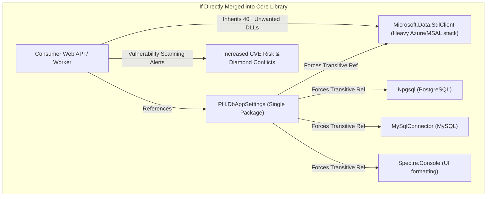

# Dependency Footprint, Transitive Bloat, and Driver Isolation Analysis

## Purpose

Analyze the dependency graph, binary size, security surface area, and transitive version conflict risks of merging CLI dependencies into the core `PH.DbAppSettings` package.

## Dependency Comparison

### 1. Current Core Library Dependencies (`PH.DbAppSettings.csproj`)

- `Microsoft.EntityFrameworkCore` & `Microsoft.EntityFrameworkCore.Relational`
- `Dapper`
- `Microsoft.Extensions.Configuration.*`
- `Microsoft.Extensions.DependencyInjection`
- `Microsoft.Extensions.Logging.Abstractions`

*Total Transitive Assemblies*: ~12 assemblies, ~3.5 MB total footprint. Agnostic of specific database drivers (host provides `Npgsql`, `Microsoft.Data.SqlClient`, or `Pomelo`).

### 2. Standalone CLI Tool Dependencies (`PH.DbAppSettings.Cli.csproj`)

To function as a standalone multi-database utility from any terminal path without a host application, the CLI references:
- `Spectre.Console` & `Spectre.Console.Cli` (Terminal UI & command routing)
- `Microsoft.Data.SqlClient` (SQL Server ADO.NET driver + Azure Identity/MSAL dependencies: ~35 assemblies)
- `Npgsql` (PostgreSQL ADO.NET driver)
- `MySqlConnector` (MySQL / MariaDB ADO.NET driver)
- `Microsoft.Data.Sqlite` (SQLite ADO.NET driver)

*Total Transitive Assemblies*: ~50+ assemblies, ~45 MB total footprint.

## Impact of Merging CLI Dependencies into Core Library

### Risk Assessment of Direct Merge

1. **Diamond Dependency Conflicts**: If a consumer app uses `Npgsql 8.x` but the core package references `Npgsql 9.x`, or requires a specific version of `Microsoft.Data.SqlClient`, build-time or runtime binding breaks occur.
2. **Container Image Bloat**: Every microservice Docker image referencing `PH.DbAppSettings` pays a 40+ MB payload penalty for drivers it never uses (e.g. a pure PostgreSQL service bundling SQL Server and MySQL drivers).
3. **Security Audit Friction**: High-compliance enterprise environments flag unused bundled native binaries (e.g. `Microsoft.Data.SqlClient.SNI` or Azure auth dependencies) in container vulnerability scans.

## Alternative Strategy: Lean In-App CLI Engine

If CLI capabilities are embedded into the core library without external drivers:
- Core includes `AppSettingsJsonAnalyzer`, `JsonTreeReconstructor`, and a lightweight runner `DbAppSettingsCliRunner`.
- The runner executes against the host application's **already configured** `IDbAppSettingsStorageEngine` or `AppDbContext`.
- Uses native `System.Console` output instead of `Spectre.Console`.
- Zero additional transitive dependencies added to `PH.DbAppSettings`.

## Handoff

- Findings: Directly adding standalone CLI drivers and Spectre.Console into `PH.DbAppSettings` causes severe transitive bloat and version conflicts. A lean in-app CLI engine reusing host-configured storage avoids all dependency bloat.
- Confidence: high.
- Assumptions: Developers running in-app commands want to target the database configured for that application.
- Open questions: What are the developer ergonomics of invoking in-app commands versus global/local tools?
