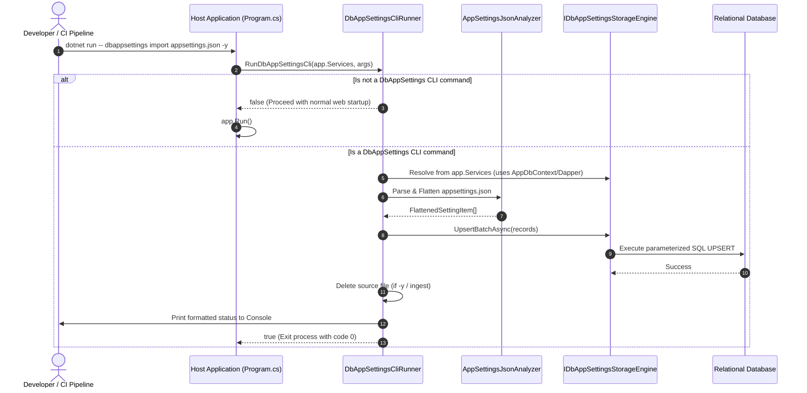

# Target Architectural Blueprint: Unified Single Package with Embedded In-App CLI and Dual-Payload Packaging

## Purpose

Define the comprehensive technical design and structural blueprint for consolidating all CLI logic into the single `PH.DbAppSettings` package while supporting in-app execution, MSBuild targets, and dual-payload NuGet distribution.

---

## 1. Unified Assembly Structure (`PH.DbAppSettings.dll`)

All core CLI logic is consolidated directly inside the `PH.DbAppSettings` assembly:

```
src/PH.DbAppSettings/
├── Configuration/
│   ├── DbAppSettingsProvider.cs
│   ├── DbAppSettingsConfigurationSource.cs
│   └── KeyNormalizer.cs
├── Storage/
│   ├── IDbAppSettingsStorageEngine.cs
│   ├── AppSettingRecord.cs
│   ├── ISqlDialect.cs
│   ├── EfCoreStorageEngine.cs
│   ├── DapperStorageEngine.cs
│   └── Dialects/
├── Data/
│   ├── AppSettingsDbContext.cs
│   ├── AppSettingsDesignTimeDbContextFactory.cs
│   └── AppSettingEntry.cs
├── Encryption/
│   ├── IValueEncryptor.cs
│   └── AesGcmValueEncryptor.cs
├── Services/
│   ├── DbAppSettingsWriter.cs
│   ├── DbAppSettingsReader.cs
│   ├── SeedService.cs
│   └── ReloadBackgroundService.cs
└── Cli/                                   <-- NEW: Unified CLI Engine
    ├── DbAppSettingsCliRunner.cs          <-- Main in-app CLI dispatcher
    ├── AppSettingsJsonAnalyzer.cs         <-- JSON flattening & sensitivity audit
    ├── JsonTreeReconstructor.cs           <-- Typed JSON tree builder
    ├── Models/
    │   ├── FlattenedSettingItem.cs
    │   └── AppSettingsAnalysisResult.cs
    └── Commands/                          <-- Standardized command handlers (Console-based)
        ├── AnalyzeCommandHandler.cs
        ├── ImportCommandHandler.cs
        ├── IngestCommandHandler.cs
        ├── ExportCommandHandler.cs
        └── RewriteJsonCommandHandler.cs
```

---

## 2. In-App CLI Execution Flow

### API Hook in Host Application (`Program.cs`)

```csharp
var app = builder.Build();

// Intercepts CLI subcommands (e.g. dotnet run -- dbappsettings analyze ...)
if (app.RunDbAppSettingsCli(args)) return;

app.Run();
```

### Flow Sequence Diagram



---

## 3. MSBuild Integration (`build/PH.DbAppSettings.targets`)

Included in the NuGet package under `build/PH.DbAppSettings.targets`:

```xml
<Project>
  <Target Name="DbAppSettings" DependsOnTargets="Build">
    <Exec Command="dotnet &quot;$(TargetPath)&quot; dbappsettings $(DbAppSettingsArgs)" />
  </Target>
</Project>
```

This allows running in any project that references the package:
```bash
dotnet build /t:DbAppSettings /p:DbAppSettingsArgs="analyze appsettings.json"
```

---

## 4. Single-Package NuGet Generation (`PH.DbAppSettings.csproj`)

```xml
<Project Sdk="Microsoft.NET.Sdk">
  <PropertyGroup>
    <TargetFramework>net10.0</TargetFramework>
    <PackageId>PH.DbAppSettings</PackageId>
    <Description>High-performance .NET 10 database configuration provider with embedded CLI tools.</Description>
    <GeneratePackageOnBuild>true</GeneratePackageOnBuild>
  </PropertyGroup>

  <!-- Core compile-time dependencies only (Zero CLI bloat) -->
  <ItemGroup>
    <PackageReference Include="Dapper" Version="2.1.66" />
    <PackageReference Include="Microsoft.EntityFrameworkCore" Version="10.*-*" />
    <PackageReference Include="Microsoft.EntityFrameworkCore.Relational" Version="10.*-*" />
    <PackageReference Include="Microsoft.EntityFrameworkCore.Sqlite" Version="10.*-*" />
    <PackageReference Include="Microsoft.Extensions.Configuration" Version="10.*-*" />
    <PackageReference Include="Microsoft.Extensions.DependencyInjection" Version="10.*-*" />
    <PackageReference Include="Microsoft.Extensions.Options.ConfigurationExtensions" Version="10.*-*" />
    <PackageReference Include="Microsoft.Extensions.Logging.Abstractions" Version="10.*-*" />
  </ItemGroup>

  <!-- Package MSBuild targets -->
  <ItemGroup>
    <None Include="build/PH.DbAppSettings.targets" Pack="true" PackagePath="build/" />
  </ItemGroup>
</Project>
```

---

## 5. Summary of Architectural Advantages

1. **True Single Assembly & Single NuGet Package**: Only `PH.DbAppSettings` is published.
2. **Zero Dependency Bloat**: No `Microsoft.Data.SqlClient`, `Npgsql`, or `MySqlConnector` packages bundled in the core assembly.
3. **No Redundant Connection String Parameters**: The in-app runner directly reuses the host application's existing database configuration.
4. **CI/CD & Docker Ready**: `dotnet MyApp.dll dbappsettings ingest appsettings.json -y` can be executed as a container init command.
