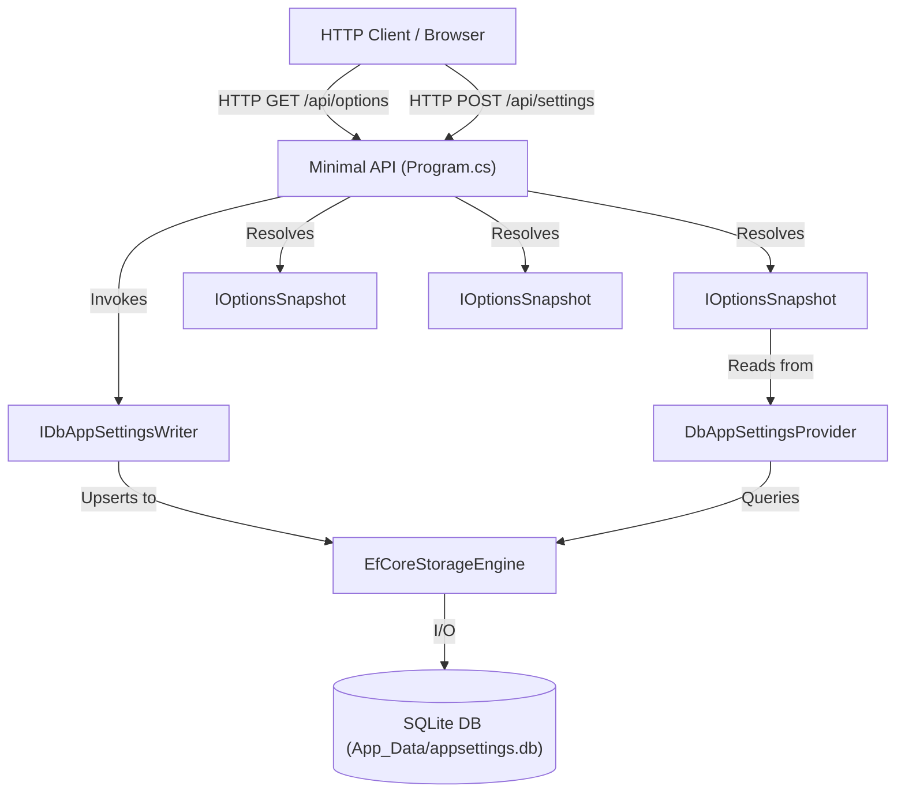

# Specification: Example Minimal API with Entity Framework Core and Local SQLite

## 1. Purpose & Scope

### 1.1 Problem Statement

Users and developers need a runnable, production-grade reference implementation demonstrating how to configure, seed, read, and dynamically update rich, multi-level nested configuration settings using `PH.DbAppSettings` with **Entity Framework Core 10** in an ASP.NET Core **Minimal API** project with typed records binding (`IOptions<T>`, `IOptionsSnapshot<T>`, `IOptionsMonitor<T>`).

### 1.2 In-Scope

- Creation of `examples/PH.DbAppSettings.Example.MinimalApi` project targeting `.NET 10.0` (`net10.0`).
- Configuration of `PH.DbAppSettings` using `UseEntityFrameworkSqlite` pointing to a local SQLite database in `App_Data/appsettings.db`.
- Automatic directory creation for `App_Data` if not already present.
- Realistic, plausible nested `appsettings.json` dataset (Application metadata, Security/JWT, Email/SMTP, Features, Pagination, Array of Allowed Origins).
- Strongly typed C# 14 record models hierarchy (`ApplicationOptions`, `PaginationOptions`, `SecurityOptions`, `EmailOptions`, `SmtpOptions`, `FeatureOptions`).
- Demonstration of typed Microsoft Options binding (`IOptions<T>`, `IOptionsSnapshot<T>`, `IOptionsMonitor<T>`).
- Demonstration of runtime configuration writing and deletion using `IDbAppSettingsWriter`.
- Exposure of REST Minimal API endpoints:
  - `GET /`: Welcome page with endpoints index and current status.
  - `GET /api/settings`: Returns all configuration key-value pairs loaded in `IConfiguration`.
  - `GET /api/options`: Returns strongly typed root options (`ApplicationOptions`).
  - `GET /api/options/email`: Returns typed `EmailOptions` (including nested `SmtpOptions`).
  - `GET /api/options/features`: Returns typed `FeatureOptions` (including array of origins and flags).
  - `GET /api/options/security`: Returns typed `SecurityOptions`.
  - `POST /api/settings`: Upserts a configuration entry via `IDbAppSettingsWriter` and triggers runtime reload.
  - `DELETE /api/settings/{key}`: Deletes a configuration entry via `IDbAppSettingsWriter`.
- Integration tests in `tests/PH.DbAppSettings.Tests` to verify bootstrapping, options resolution, and runtime mutations.
- Registration in `PH.DbAppSettings.slnx` under `/examples/`.

### 1.3 Out-of-Scope

- Complex frontend web applications (focus is clean, documented Minimal API).

---

## 2. Definitions & Terminology

| Term | Definition |
|---|---|
| `Minimal API` | ASP.NET Core lightweight HTTP API architecture using route handlers. |
| `App_Data` | Dedicated local directory for storing SQLite database file (`appsettings.db`). |
| `UseEntityFrameworkSqlite` | Fluent extension method configuring `PH.DbAppSettings` to use EF Core with SQLite. |
| `IOptionsSnapshot<T>` | Microsoft Options interface providing scoped, per-request access to reloaded configuration. |

---

## 3. Requirements & Constraints

- **REQ-001**: Project MUST target `net10.0` and C# 14 with `#nullable enable`.
- **REQ-002**: Database MUST reside in `App_Data/appsettings.db` relative to content root.
- **REQ-003**: The application MUST automatically ensure the `App_Data` folder exists before initializing SQLite.
- **REQ-004**: Bootstrap configuration MUST initialize `PH.DbAppSettings` via `builder.Configuration.AddDbAppSettings(...)` with `AutoMigrate = true` and `SeedOnEmpty = true`.
- **REQ-005**: The application MUST register `AddDbAppSettingsServices(...)` with EF Core and reload interval.
- **REQ-006**: Initial `appsettings.json` MUST contain realistic, nested configuration settings for application, security, email/SMTP, features, and pagination.
- **REQ-007**: Options MUST be bound using `builder.Services.Configure<ApplicationOptions>(builder.Configuration.GetSection("Application"))` and sub-sections.

---

## 4. Architecture & Data Model



### 4.1 Plausible Nested `appsettings.json` Structure

```json
{
  "Logging": {
    "LogLevel": {
      "Default": "Information",
      "Microsoft.AspNetCore": "Warning",
      "PH.DbAppSettings": "Debug"
    }
  },
  "DbAppSettings": {
    "ConnectionString": "Data Source=App_Data/appsettings.db"
  },
  "Application": {
    "Title": "Inventory & Order Management API",
    "Version": "1.2.0",
    "Environment": "Production",
    "EnableSwagger": true,
    "Pagination": {
      "DefaultPageSize": 25,
      "MaxPageSize": 100
    },
    "Security": {
      "JwtIssuer": "https://auth.company.com",
      "JwtAudience": "inventory-api",
      "TokenExpirationMinutes": 60,
      "RequireHttps": true
    },
    "Email": {
      "SenderName": "Inventory Notification Service",
      "SenderEmail": "no-reply@company.com",
      "Smtp": {
        "Host": "smtp.mailgun.org",
        "Port": 587,
        "UseSsl": true,
        "Username": "postmaster@company.com"
      }
    },
    "Features": {
      "EnableCache": true,
      "CacheDurationSeconds": 300,
      "MaintenanceMode": false,
      "AllowedOrigins": [
        "https://app.company.com",
        "https://admin.company.com"
      ]
    }
  }
}
```

### 4.2 Strongly Typed C# 14 Records Models

```csharp
namespace PH.DbAppSettings.Example.MinimalApi.Models;

public sealed record ApplicationOptions
{
    public string Title { get; init; } = "";
    public string Version { get; init; } = "";
    public string Environment { get; init; } = "";
    public bool EnableSwagger { get; init; }
    public PaginationOptions Pagination { get; init; } = new();
    public SecurityOptions Security { get; init; } = new();
    public EmailOptions Email { get; init; } = new();
    public FeatureOptions Features { get; init; } = new();
}

public sealed record PaginationOptions
{
    public int DefaultPageSize { get; init; } = 25;
    public int MaxPageSize { get; init; } = 100;
}

public sealed record SecurityOptions
{
    public string JwtIssuer { get; init; } = "";
    public string JwtAudience { get; init; } = "";
    public int TokenExpirationMinutes { get; init; } = 60;
    public bool RequireHttps { get; init; } = true;
}

public sealed record EmailOptions
{
    public string SenderName { get; init; } = "";
    public string SenderEmail { get; init; } = "";
    public SmtpOptions Smtp { get; init; } = new();
}

public sealed record SmtpOptions
{
    public string Host { get; init; } = "";
    public int Port { get; init; } = 587;
    public bool UseSsl { get; init; } = true;
    public string Username { get; init; } = "";
}

public sealed record FeatureOptions
{
    public bool EnableCache { get; init; } = true;
    public int CacheDurationSeconds { get; init; } = 300;
    public bool MaintenanceMode { get; init; }
    public IReadOnlyList<string> AllowedOrigins { get; init; } = [];
}
```

### 4.3 API Contracts

```csharp
public sealed record SetSettingRequest(string Key, string? Value);
public sealed record ApiResponse<T>(bool Success, string Message, T? Data);
```

---

## 5. Dependencies & Integrations

- **`PH.DbAppSettings`**: Project reference to `src/PH.DbAppSettings/PH.DbAppSettings.csproj`.
- **`Microsoft.AspNetCore.OpenApi`**: Version `10.*-*`.
- **`Scalar.AspNetCore`** or standard OpenAPI metadata for interactive documentation.

---

## 6. Acceptance Criteria

- **AC-001 (Bootstrapping & Nested Seeding)**:
  - **Given**: An empty SQLite database at `App_Data/appsettings.db`.
  - **When**: The Minimal API application starts.
  - **Then**: `AppSettings` table is created, nested settings from `appsettings.json` are seeded, and `GET /api/options` returns `Title = "Inventory & Order Management API"`, `Email.Smtp.Host = "smtp.mailgun.org"`, `Features.AllowedOrigins[0] = "https://app.company.com"`.
  - **[PHASE: RED] Failure Mode**: `FileNotFoundException` or compilation error when project/types are missing.

- **AC-002 (Nested Options Sub-Endpoints)**:
  - **Given**: The running Minimal API application.
  - **When**: `GET /api/options/email` and `GET /api/options/features` are invoked.
  - **Then**: Sub-sections bind independently into `EmailOptions` and `FeatureOptions` with status code 200.
  - **[PHASE: RED] Failure Mode**: 404 Not Found or null properties.

- **AC-003 (Runtime Setting Mutation & Snapshot Refresh)**:
  - **Given**: The running Minimal API application.
  - **When**: A `POST /api/settings` request is executed with `{"key": "Application:Features:EnableCache", "value": "false"}`.
  - **Then**: `IDbAppSettingsWriter` updates the row in SQLite, and subsequent calls to `GET /api/options/features` reflect `EnableCache = false`.
  - **[PHASE: RED] Failure Mode**: Value remains `true` or exception thrown.

---

## 7. Test Automation Strategy

### 7.1 Test Framework

- **xUnit 2.x/3.x** in `tests/PH.DbAppSettings.Tests`.
- Integration tests using `ExampleMinimalApiTests.cs` validating options binding, sub-section binding, and writer mutations.

### 7.2 Commands

```bash
# Run specific example integration test (RED / GREEN)
dotnet test tests/PH.DbAppSettings.Tests/PH.DbAppSettings.Tests.csproj --filter FullyQualifiedName~ExampleMinimalApiTests

# Run full solution test suite (REFACTOR)
dotnet test PH.DbAppSettings.slnx
```

---

## 8. Examples & Edge Cases

### 8.1 API Usage Examples

```bash
# 1. Fetch full nested options
curl -X GET http://localhost:5000/api/options

# 2. Fetch specific nested section (Email / Smtp)
curl -X GET http://localhost:5000/api/options/email

# 3. Fetch specific nested section (Features & Origins)
curl -X GET http://localhost:5000/api/options/features

# 4. Update configuration at runtime
curl -X POST http://localhost:5000/api/settings \
  -H "Content-Type: application/json" \
  -d '{"key": "Application:Features:MaintenanceMode", "value": "true"}'
```

---

## 9. Spec Validation & AI-Readiness

- [X] Self-contained context with complete JSON schema and C# models.
- [X] Plausible, real-world multi-level nested data (Application, Security, Email/SMTP, Features).
- [X] Testable acceptance criteria with Given/When/Then and RED failure modes.
- [X] Explicit TDD tasks with RED $\rightarrow$ GREEN $\rightarrow$ REFACTOR triads.
- [X] Exact project paths and naming conventions defined.

---

## 10. References & Instructions

- `.agents/rules/csharp-coding-standards.md`
- `.agents/rules/dotnet-minimal-api.md`
- `.agents/skills/test-driven-development/SKILL.md`

---

## 11. Task Breakdown

```yaml
tasks:
  - id: TASK-013-RED
    title: "Write failing integration test for Example Minimal API nested options"
    type: test
    priority: critical
    phase: RED
    objective: "Create tests/PH.DbAppSettings.Tests/ExampleMinimalApiTests.cs covering nested options resolution, sub-section endpoints, and runtime setting updates."
    files_to_create:
      - path: "tests/PH.DbAppSettings.Tests/ExampleMinimalApiTests.cs"
        reason: "Integration test fixture for Minimal API."
    validation:
      - Run: "dotnet test tests/PH.DbAppSettings.Tests/PH.DbAppSettings.Tests.csproj --filter FullyQualifiedName~ExampleMinimalApiTests"
      - Expected: "Fails with compilation error or missing project."

  - id: TASK-013-GREEN
    title: "Implement Example Minimal API project with nested options"
    type: code
    priority: critical
    phase: GREEN
    objective: "Scaffold examples/PH.DbAppSettings.Example.MinimalApi with net10.0, App_Data SQLite configuration, Program.cs, rich nested options models, and REST endpoints."
    files_to_create:
      - path: "examples/PH.DbAppSettings.Example.MinimalApi/PH.DbAppSettings.Example.MinimalApi.csproj"
        reason: "Minimal API project file."
      - path: "examples/PH.DbAppSettings.Example.MinimalApi/appsettings.json"
        reason: "Rich nested bootstrap and seed configuration."
      - path: "examples/PH.DbAppSettings.Example.MinimalApi/Models/ApplicationOptions.cs"
        reason: "Strongly typed nested options record hierarchy."
      - path: "examples/PH.DbAppSettings.Example.MinimalApi/Program.cs"
        reason: "Minimal API application entry point and endpoints."
    validation:
      - Run: "dotnet test tests/PH.DbAppSettings.Tests/PH.DbAppSettings.Tests.csproj --filter FullyQualifiedName~ExampleMinimalApiTests"
      - Expected: "Passes (GREEN)."

  - id: TASK-013-REFACTOR
    title: "Register project in solution and verify full suite"
    type: refactor
    priority: high
    phase: REFACTOR
    objective: "Add examples/PH.DbAppSettings.Example.MinimalApi to PH.DbAppSettings.slnx, format code, and verify all tests green."
    files_to_modify:
      - path: "PH.DbAppSettings.slnx"
        reason: "Include example project in solution."
    validation:
      - Run: "dotnet test PH.DbAppSettings.slnx"
      - Expected: "All tests pass (100% green)."
```

---

## 12. Conflict Detection

- **Conflict Check**: Clean progressive spec ID `006`.
- **Resolution**: No active specs in `/specs/`.

---

## 13. Files Added to Context

- `src/PH.DbAppSettings/DbAppSettingsExtensions.cs`
- `src/PH.DbAppSettings/DbAppSettingsMutableOptions.cs`
- `src/PH.DbAppSettings/Storage/EfCoreStorageEngine.cs`
