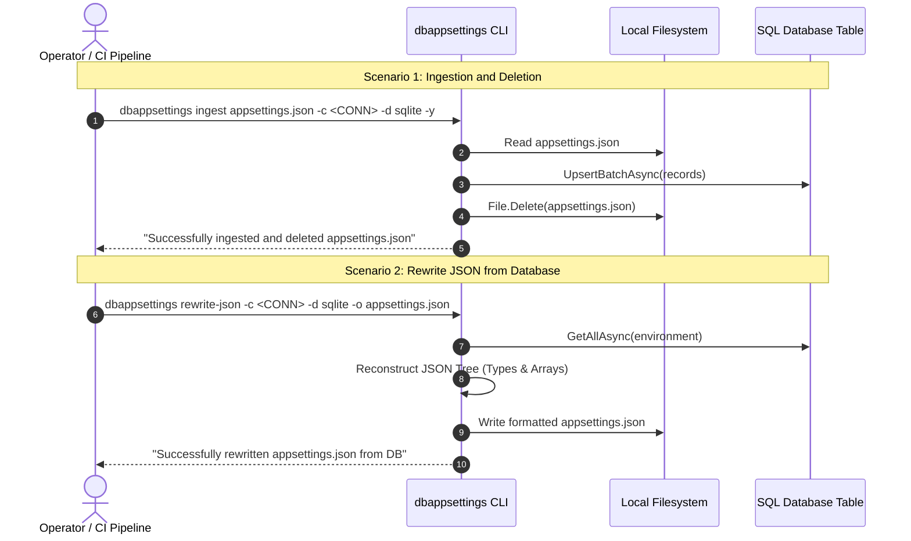

# Specification: CLI Ingest-and-Delete, Standalone Database Bootstrapping, and Rewrite-JSON Command

## 1. Purpose & Scope

### 1.1 Problem Statement

In secure production environments (such as containers, Kubernetes pods, and air-gapped VMs), `appsettings.json` files should not remain on the local filesystem after initial deployment because they may expose sensitive architecture and configuration details.

The application must be capable of running in 100% standalone mode directly from the database table (relying only on an environment variable for the connection string). Additionally, developers and operators need CLI capabilities to:
1. Ingest `appsettings.json` into the database table and securely delete the source file after user confirmation or automated flag.
2. Reconstruct/rewrite `appsettings.json` from the database table on demand using a dedicated CLI command (`rewrite-json`).

### 1.2 In-Scope

- **Standalone Bootstrapping without Local JSON**:
  - Verify and guarantee that `AddDbAppSettings` and `DbAppSettingsProvider` function seamlessly when NO `appsettings.json` exists on disk, reading the connection string exclusively from `DbAppSettings__ConnectionString` (or `DbAppSettings:ConnectionString`).
- **CLI `ingest` Command (or `import --delete-source`)**:
  - `dbappsettings ingest <FILE> -c <CONN> -d <DIALECT> -e <ENV>` (with `--yes`/`-y` to bypass confirmation prompt).
  - Validates JSON, imports flattened keys to the target SQL table, and upon confirmation deletes the source JSON file.
- **CLI `rewrite-json` Command**:
  - `dbappsettings rewrite-json -c <CONN> -d <DIALECT> -e <ENV> -o <OUTPUT_PATH>`.
  - Reconstructs a clean, hierarchical JSON file (reconstructing objects, primitive types, booleans, integers, strings, arrays) from the database table.
  - Overwrites existing destination file or writes to specified target path.
- **Unit and Integration Tests**:
  - Integration tests for standalone application execution without `appsettings.json`.
  - CLI command unit/integration tests for `ingest` (with deletion verification) and `rewrite-json` (with roundtrip data parity).
- **Documentation**:
  - Full XML documentation on public API methods.
  - Update `README.md` and CLI `AGENTS.md`.

### 1.3 Out-of-Scope

- Physical file shredding beyond standard file deletion (`File.Delete`).

---

## 2. Definitions & Terminology

| Term | Definition |
|---|---|
| `Ingest` | The atomic process of parsing, validating, importing configuration into SQL, and deleting the source JSON file. |
| `Rewrite-JSON` | Reconstructing a formatted, indented JSON configuration file from rows in the database table. |
| `Standalone DB Mode` | Application execution mode where zero local JSON configuration files exist, and all configuration is read from SQL storage. |

---

## 3. Requirements & Constraints

- **REQ-001**: Application MUST start and populate `IConfiguration` and `IOptions<T>` when `appsettings.json` does not exist on disk, receiving only the connection string via environment variable.
- **REQ-002**: The CLI tool MUST provide an `ingest` command (and `--delete-source` flag on `import`) that asks for confirmation before deleting the source JSON file, or deletes immediately if `--yes` / `-y` is passed.
- **REQ-003**: The CLI tool MUST provide a `rewrite-json` command that exports configuration from the database into a formatted JSON file with default output `appsettings.json`.
- **REQ-004**: `rewrite-json` MUST parse typed values (integers, booleans, strings) so that `"true"` becomes `true`, `"42"` becomes `42`, and array indexes `Key:0`, `Key:1` become JSON arrays `["..."]`.
- **REQ-005**: All CLI commands MUST support all 4 SQL dialects: `sqlserver`, `postgres`, `sqlite`, `mysql`.

---

## 4. Architecture & Command Workflows



### 4.1 CLI Command Signatures

1. **Ingest Command**:
   ```bash
   dbappsettings ingest appsettings.json -c "Data Source=app.db" -d sqlite -e Production -y
   ```
2. **Rewrite JSON Command**:
   ```bash
   dbappsettings rewrite-json -c "Data Source=app.db" -d sqlite -e Production -o appsettings.json
   ```

---

## 5. Dependencies & Integrations

- **`Spectre.Console` / `Spectre.Console.Cli`**: For prompts and visual tables.
- **`System.Text.Json`**: For typed JSON node construction and formatting.

---

## 6. Acceptance Criteria

- **AC-001 (Standalone App Bootstrapping without JSON)**:
  - **Given**: A database table pre-seeded with configuration and NO `appsettings.json` on disk.
  - **When**: The application boots with `DbAppSettings__ConnectionString` set as an environment variable.
  - **Then**: `AddDbAppSettings` successfully connects, loads all configuration keys into `IConfiguration`, and binds typed `IOptions<T>` without error.
  - **[PHASE: RED] Failure Mode**: `FileNotFoundException` or null options.

- **AC-002 (CLI Ingest Command with File Deletion)**:
  - **Given**: A valid `appsettings.json` file in a temporary folder.
  - **When**: Running `dbappsettings ingest <path> -c <conn> -d sqlite -y`.
  - **Then**: The settings are inserted into the database table and `File.Exists(path)` returns `false`.
  - **[PHASE: RED] Failure Mode**: Command fails to delete file or fails to insert entries.

- **AC-003 (CLI Rewrite-JSON with Accurate Type and Array Reconstruction)**:
  - **Given**: Database entries containing string `"My App"`, integer `"42"`, boolean `"true"`, and array `AllowedOrigins:0="https://a.com"`, `AllowedOrigins:1="https://b.com"`.
  - **When**: Running `dbappsettings rewrite-json -c <conn> -d sqlite -o <outPath>`.
  - **Then**: The resulting JSON file parses back with `AllowedOrigins` as a JSON Array, booleans as JSON Booleans, and numbers as JSON Numbers.
  - **[PHASE: RED] Failure Mode**: Values output exclusively as strings or arrays formatted as objects.

---

## 7. Test Automation Strategy

### 7.1 Test Framework

- **xUnit 2.x/3.x** in `tests/PH.DbAppSettings.Tests`.
- Dedicated integration tests:
  - `StandaloneBootstrapTests.cs` (verifying app execution with 0 JSON files on disk).
  - `CliIngestAndRewriteTests.cs` (verifying `ingest` deletion and `rewrite-json` roundtrip).

### 7.2 Commands

```bash
# Run standalone and CLI ingest/rewrite tests (RED / GREEN)
dotnet test tests/PH.DbAppSettings.Tests/PH.DbAppSettings.Tests.csproj --filter FullyQualifiedName~CliIngestAndRewriteTests

# Run full solution test suite (REFACTOR)
dotnet test PH.DbAppSettings.slnx
```

---

## 8. Examples & Edge Cases

### 8.1 Typed JSON Tree Reconstruction Example

Input DB Entries:
- `App:Name` = `"Demo"`
- `App:Port` = `"8080"`
- `App:IsActive` = `"true"`
- `App:Tags:0` = `"alpha"`
- `App:Tags:1` = `"beta"`

Output JSON in `rewrite-json`:
```json
{
  "App": {
    "Name": "Demo",
    "Port": 8080,
    "IsActive": true,
    "Tags": [
      "alpha",
      "beta"
    ]
  }
}
```

---

## 9. Spec Validation & AI-Readiness

- [X] Self-contained context and explicit command contracts.
- [X] Testable acceptance criteria with Given/When/Then and RED failure modes.
- [X] Explicit TDD tasks with RED $\rightarrow$ GREEN $\rightarrow$ REFACTOR triads.
- [X] Exact project paths and naming conventions defined.

---

## 10. References & Instructions

- `.agents/rules/csharp-coding-standards.md`
- `.agents/rules/dotnet-cli-usage.md`
- `.agents/skills/test-driven-development/SKILL.md`

---

## 11. Task Breakdown

```yaml
tasks:
  - id: TASK-015-RED
    title: "Write failing tests for Ingest command, Rewrite-JSON command, and Standalone DB execution"
    type: test
    priority: critical
    phase: RED
    objective: "Create tests/PH.DbAppSettings.Tests/CliIngestAndRewriteTests.cs and StandaloneBootstrapTests.cs asserting file deletion during ingest, typed array rewrite-json output, and 0-file standalone bootstrapping."
    files_to_create:
      - path: "tests/PH.DbAppSettings.Tests/CliIngestAndRewriteTests.cs"
        reason: "Test fixture for ingest and rewrite-json CLI commands."
      - path: "tests/PH.DbAppSettings.Tests/StandaloneBootstrapTests.cs"
        reason: "Test fixture for standalone DB-only application execution."
    validation:
      - Run: "dotnet test tests/PH.DbAppSettings.Tests/PH.DbAppSettings.Tests.csproj --filter FullyQualifiedName~CliIngestAndRewriteTests"
      - Expected: "Fails (RED) with compilation error or missing commands."

  - id: TASK-015-GREEN
    title: "Implement IngestCommand, RewriteJsonCommand, and typed JSON reconstruction"
    type: code
    priority: critical
    phase: GREEN
    objective: "Implement IngestCommand.cs and RewriteJsonCommand.cs in src/PH.DbAppSettings.Cli/Commands, add JsonTreeBuilder service for typed/array reconstruction, and wire into Program.cs."
    files_to_create:
      - path: "src/PH.DbAppSettings.Cli/Commands/IngestCommand.cs"
        reason: "CLI command for ingestion and safe source deletion."
      - path: "src/PH.DbAppSettings.Cli/Commands/RewriteJsonCommand.cs"
        reason: "CLI command to reconstruct typed JSON files from DB."
      - path: "src/PH.DbAppSettings.Cli/Services/JsonTreeReconstructor.cs"
        reason: "Reconstructs typed JSON trees and arrays from flattened key-value pairs."
    files_to_modify:
      - path: "src/PH.DbAppSettings.Cli/Program.cs"
        reason: "Register ingest and rewrite-json commands."
    validation:
      - Run: "dotnet test tests/PH.DbAppSettings.Tests/PH.DbAppSettings.Tests.csproj --filter FullyQualifiedName~CliIngestAndRewriteTests"
      - Expected: "Passes (GREEN)."

  - id: TASK-015-REFACTOR
    title: "Update documentation and verify full test suite"
    type: refactor
    priority: high
    phase: REFACTOR
    objective: "Update README.md, CLI AGENTS.md, and run full test suite to guarantee 100% green tests."
    files_to_modify:
      - path: "README.md"
        reason: "Document ingest, rewrite-json, and standalone DB mode."
      - path: "src/PH.DbAppSettings.Cli/AGENTS.md"
        reason: "Document new CLI commands."
    validation:
      - Run: "dotnet test PH.DbAppSettings.slnx"
      - Expected: "All tests pass (100% green)."
```

---

## 12. Conflict Detection

- **Conflict Check**: Progressive spec ID `008`. Specs 001-007 completed in `/specs/implemented/`.
- **Resolution**: Clean progressive implementation.

---

## 13. Files Added to Context

- `src/PH.DbAppSettings.Cli/Commands/ImportCommand.cs`
- `src/PH.DbAppSettings.Cli/Commands/ExportCommand.cs`
- `src/PH.DbAppSettings/Configuration/DbAppSettingsProvider.cs`
- `src/PH.DbAppSettings/DbAppSettingsExtensions.cs`
