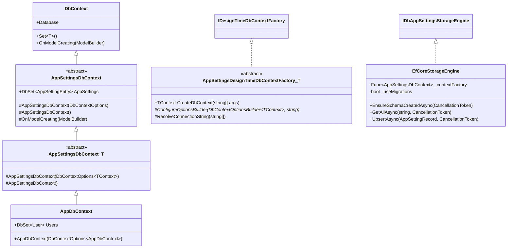

# TDD Specification: Abstract AppSettingsDbContext and Multi-Provider Host Database Integration

## 1. Purpose & Scope

### In Scope
- Redefine `AppSettingsDbContext` as a `public abstract` base class (`AppSettingsDbContext` and `AppSettingsDbContext<TContext>`) inheritable by consumer application `DbContext` types.
- Enable host applications to co-locate the `AppSettings` table directly within their primary application relational database.
- Eliminate hardcoded SQLite fallbacks across factories, `DbAppSettingsProvider`, `ReloadBackgroundService`, and configuration options.
- Provide a reusable abstract base class `AppSettingsDesignTimeDbContextFactory<TContext>` to facilitate host EF Core design-time migrations.
- Support multiple relational providers (PostgreSQL via Npgsql, SQL Server via Microsoft.EntityFrameworkCore.SqlServer, MySQL via Pomelo, SQLite) using generic extension delegates.
- Implement schema initialization switching in `EfCoreStorageEngine` supporting `EnsureCreatedAsync` and `MigrateAsync` via a `UseMigrations` option.
- Update test infrastructure (`TestAppSettingsDbContext`) and example applications to consume the abstract base context pattern.

### Out of Scope
- Direct modifications to the Dapper storage engine implementation (`DapperStorageEngine`), which remains provider-agnostic via `ISqlDialect`.
- Addition of direct package dependencies on external database drivers (Npgsql, Pomelo) to `PH.DbAppSettings.csproj` (drivers remain the host application's choice).

## 2. Definitions & Terminology

| Term | Definition |
| :--- | :--- |
| `AppSettingsDbContext` | Abstract base EF Core `DbContext` exposing `DbSet<AppSettingEntry>` and configuring entity mappings. |
| `AppDbContext` | Host application's concrete `DbContext` inheriting from `AppSettingsDbContext<AppDbContext>`. |
| `AppSettingsDesignTimeDbContextFactory` | Abstract base class implementing `IDesignTimeDbContextFactory<TContext>` for host migration tooling. |
| `UseMigrations` | Boolean configuration option determining whether schema initialization calls `MigrateAsync` or `EnsureCreatedAsync`. |
| `Co-location` | Storing configuration tables in the same application database schema as business entities. |

## 3. Requirements & Constraints

### Functional Requirements
- **REQ-001**: `AppSettingsDbContext` MUST be a `public abstract` class extending `Microsoft.EntityFrameworkCore.DbContext`.
- **REQ-002**: `AppSettingsDbContext` MUST expose `public DbSet<AppSettingEntry> AppSettings => Set<AppSettingEntry>()`.
- **REQ-003**: `AppSettingsDbContext` MUST apply `AppSettingEntryConfiguration` within `OnModelCreating(ModelBuilder)`.
- **REQ-004**: `PH.DbAppSettings` MUST provide `public abstract class AppSettingsDbContext<TContext> : AppSettingsDbContext where TContext : DbContext` with constructors accepting `DbContextOptions<TContext>` and parameterless.
- **REQ-005**: `PH.DbAppSettings` MUST provide `public abstract class AppSettingsDesignTimeDbContextFactory<TContext> : IDesignTimeDbContextFactory<TContext> where TContext : AppSettingsDbContext` resolving connection strings and delegating to an abstract `ConfigureOptionsBuilder`.
- **REQ-006**: Concrete class `AppSettingsDbContextFactory` with hardcoded SQLite MUST be removed from `PH.DbAppSettings`.
- **REQ-007**: `DbAppSettingsMutableOptions` MUST provide generic methods `UseEntityFramework<TContext>(Action<DbContextOptionsBuilder<TContext>>)` and `UseEntityFramework<TContext>(Action<DbContextOptionsBuilder<TContext>, string>)` where `TContext : AppSettingsDbContext`.
- **REQ-008**: `DbAppSettingsExtensions` MUST provide generic methods `AddDbAppSettings<TContext>` and `AddDbAppSettingsServices<TContext>` where `TContext : AppSettingsDbContext`.
- **REQ-009**: `EfCoreStorageEngine` MUST execute `context.Database.MigrateAsync(ct)` when `DbAppSettingsOptions.UseMigrations` is true, and `context.Database.EnsureCreatedAsync(ct)` when false.
- **REQ-010**: `DbAppSettingsProvider` and `ReloadBackgroundService` MUST NOT contain fallback logic creating SQLite contexts silently.

### Non-Functional & Security Constraints
- **NFR-001**: Target framework MUST be .NET 10 (`net10.0`) with C# 14.
- **NFR-002**: Nullable reference types MUST be enabled (`#nullable enable`) with zero compiler warnings.
- **SEC-001**: Connection strings MUST NEVER be stored in the database.

## 4. Architecture & Interfaces

### Class Hierarchy and Seams



### Public API Contracts

```csharp
namespace PH.DbAppSettings.Data;

public abstract class AppSettingsDbContext : DbContext
{
    protected AppSettingsDbContext(DbContextOptions options) : base(options) { }
    protected AppSettingsDbContext() : base() { }
    public DbSet<AppSettingEntry> AppSettings => Set<AppSettingEntry>();
    protected override void OnModelCreating(ModelBuilder modelBuilder)
    {
        base.OnModelCreating(modelBuilder);
        modelBuilder.ApplyConfiguration(new AppSettingEntryConfiguration());
    }
}

public abstract class AppSettingsDbContext<TContext> : AppSettingsDbContext where TContext : DbContext
{
    protected AppSettingsDbContext(DbContextOptions<TContext> options) : base(options) { }
    protected AppSettingsDbContext() : base() { }
}

public abstract class AppSettingsDesignTimeDbContextFactory<TContext> : IDesignTimeDbContextFactory<TContext>
    where TContext : AppSettingsDbContext
{
    public TContext CreateDbContext(string[] args);
    protected abstract void ConfigureOptionsBuilder(DbContextOptionsBuilder<TContext> builder, string connectionString);
    protected virtual string ResolveConnectionString(string[] args);
    protected virtual TContext CreateDbContextInstance(DbContextOptions<TContext> options);
}
```

## 5. Dependencies & Integrations

- `Microsoft.EntityFrameworkCore` (`10.*-*`)
- `Microsoft.EntityFrameworkCore.Relational` (`10.*-*`)
- `Microsoft.Extensions.Configuration` (`10.*-*`)
- `Microsoft.Extensions.DependencyInjection` (`10.*-*`)

## 6. Acceptance Criteria

### AC-001: Abstract DbContext Inheritance
- **Given** a host application defining `public class AppDbContext(DbContextOptions<AppDbContext> options) : AppSettingsDbContext<AppDbContext>(options)`.
- **When** `AppDbContext` is instantiated with configured `DbContextOptions<AppDbContext>`.
- **Then** `AppDbContext.AppSettings` is accessible as `DbSet<AppSettingEntry>` and model metadata includes `AppSettingEntry`.
- **Expected Failure in RED**: Attempting to instantiate abstract `AppSettingsDbContext` or compilation failure when deriving without matching base constructor.

### AC-002: Design-Time Factory Extension
- **Given** a derived design-time factory `public class AppDbContextFactory : AppSettingsDesignTimeDbContextFactory<AppDbContext>`.
- **When** `CreateDbContext(args)` is invoked.
- **Then** it resolves the connection string and creates a valid `AppDbContext` instance with configured options.
- **Expected Failure in RED**: Missing `AppSettingsDesignTimeDbContextFactory<TContext>` or failure to invoke `ConfigureOptionsBuilder`.

### AC-003: Multi-Provider Configuration Options
- **Given** `DbAppSettingsMutableOptions` configured via `options.UseEntityFramework<AppDbContext>((builder, connStr) => builder.UseSqlite(connStr))`.
- **When** `options.ToOptions()` is invoked.
- **Then** `StorageEngineFactory` produces an `EfCoreStorageEngine` that operates against `AppDbContext`.
- **Expected Failure in RED**: Missing generic `UseEntityFramework<TContext>` overloads.

### AC-004: Schema Initialization Migration Switching
- **Given** `EfCoreStorageEngine` configured with `useMigrations: true`.
- **When** `EnsureSchemaCreatedAsync` is executed.
- **Then** it invokes `Database.MigrateAsync(ct)` instead of `EnsureCreatedAsync(ct)`.
- **Expected Failure in RED**: `EnsureSchemaCreatedAsync` unconditionally calling `EnsureCreatedAsync`.

### AC-005: Generic Extension Registration
- **Given** `IServiceCollection` or `IConfigurationBuilder`.
- **When** `AddDbAppSettings<AppDbContext>(bootstrapConfig, options => ...)` is invoked.
- **Then** `DbAppSettingsProvider` is registered and loads configuration data from `AppDbContext`.
- **Expected Failure in RED**: Missing generic `AddDbAppSettings<TContext>` extensions.

## 7. Test Automation Strategy

### Execution Commands
- Single test run (RED/GREEN verification):
  `dotnet test tests/PH.DbAppSettings.Tests/PH.DbAppSettings.Tests.csproj --filter "FullyQualifiedName~AbstractDbContextTests"`
- Full test suite run (REFACTOR verification):
  `dotnet test PH.DbAppSettings.slnx`

### Testing Conventions
- All tests MUST follow AAA (Arrange, Act, Assert) structure.
- Minimal mocking: Real in-memory SQLite connections via `TestAppSettingsDbContext` used for EF Core testing.

## 8. Examples & Edge Cases

### Example: PostgreSQL Host Configuration
```csharp
builder.Configuration.AddDbAppSettings<AppDbContext>(bootstrapConfig, options =>
{
    options.UseEntityFramework<AppDbContext>((builder, connStr) => builder.UseNpgsql(connStr));
    options.UseMigrations = true;
});
```

### Edge Case: Missing ConnectionString with ConnectionString Delegate
- When calling `UseEntityFramework<TContext>((builder, connStr) => ...)` without a configured connection string, an `InvalidOperationException` is thrown with an actionable message.

## 9. Spec Validation & AI-Readiness

- [X] Unambiguous language without metaphors.
- [X] Definitions for all domain terms in Section 2.
- [X] Requirements use MUST/SHALL/SHOULD keywords.
- [X] Acceptance criteria in Given/When/Then format with RED failure modes.
- [X] Independent and atomic task breakdown in Section 11.
- [X] Markdown style rules strictly followed.

## 10. References & Instructions

- `.agents/rules/csharp-coding-standards.md`
- `.agents/rules/dotnet-cli-usage.md`
- `.agents/skills/test-driven-development/SKILL.md`
- `reasoning/appsettings-dbcontext-refactor/README.md`

## 11. Task Breakdown

```yaml
tasks:
  - id: TASK-001-RED
    title: "[PHASE: RED] Write tests for abstract AppSettingsDbContext and TestAppSettingsDbContext"
    type: test
    priority: critical
    dependencies: []
    objective: |
      Write unit tests in AbstractDbContextTests.cs verifying that TestAppSettingsDbContext inherits AppSettingsDbContext<TestAppSettingsDbContext>, exposes AppSettings DbSet, and configures AppSettingEntry in OnModelCreating.
    acceptance_criteria:
      - Tests fail because AppSettingsDbContext is currently concrete and lacks generic base class.
    files_to_create:
      - path: tests/PH.DbAppSettings.Tests/AbstractDbContextTests.cs
        reason: Test abstract DbContext inheritance contracts.
      - path: tests/PH.DbAppSettings.Tests/Helpers/TestAppSettingsDbContext.cs
        reason: Test fixture context inheriting AppSettingsDbContext.

  - id: TASK-001-GREEN
    title: "[PHASE: GREEN] Implement abstract AppSettingsDbContext and generic AppSettingsDbContext<TContext>"
    type: code
    priority: critical
    dependencies: [TASK-001-RED]
    objective: |
      Refactor AppSettingsDbContext to public abstract class and add generic AppSettingsDbContext<TContext> class.
    acceptance_criteria:
      - AbstractDbContextTests pass.
    files_to_create:
      - path: src/PH.DbAppSettings/Data/AppSettingsDbContext.cs
        reason: Declare abstract base classes.

  - id: TASK-001-REFACTOR
    title: "[PHASE: REFACTOR] Clean up constructors and model building helpers"
    type: refactor
    priority: normal
    dependencies: [TASK-001-GREEN]
    objective: |
      Ensure primary constructors and parameterless constructors follow C# 14 best practices.
    acceptance_criteria:
      - Full test suite passes.

  - id: TASK-002-RED
    title: "[PHASE: RED] Write tests for AppSettingsDesignTimeDbContextFactory base class"
    type: test
    priority: critical
    dependencies: [TASK-001-REFACTOR]
    objective: |
      Write unit tests in DesignTimeFactoryTests.cs verifying that a derived factory inherits AppSettingsDesignTimeDbContextFactory, resolves connection strings, and creates valid DbContext instances.
    acceptance_criteria:
      - Tests fail because AppSettingsDesignTimeDbContextFactory does not exist yet.
    files_to_create:
      - path: tests/PH.DbAppSettings.Tests/DesignTimeFactoryTests.cs
        reason: Test design-time factory base class behavior.

  - id: TASK-002-GREEN
    title: "[PHASE: GREEN] Implement AppSettingsDesignTimeDbContextFactory and remove obsolete factory"
    type: code
    priority: critical
    dependencies: [TASK-002-RED]
    objective: |
      Implement public abstract class AppSettingsDesignTimeDbContextFactory<TContext> in src/PH.DbAppSettings/Data/ and delete obsolete concrete AppSettingsDbContextFactory.cs and Migrations snapshot.
    acceptance_criteria:
      - DesignTimeFactoryTests pass.
    files_to_create:
      - path: src/PH.DbAppSettings/Data/AppSettingsDesignTimeDbContextFactory.cs
        reason: Abstract design-time factory base.

  - id: TASK-002-REFACTOR
    title: "[PHASE: REFACTOR] Refactor connection string resolution and error handling"
    type: refactor
    priority: normal
    dependencies: [TASK-002-GREEN]
    objective: |
      Refine ResolveConnectionString and CreateDbContextInstance error messages.
    acceptance_criteria:
      - Full test suite passes.

  - id: TASK-003-RED
    title: "[PHASE: RED] Write tests for EfCoreStorageEngine schema creation and migration switching"
    type: test
    priority: critical
    dependencies: [TASK-002-REFACTOR]
    objective: |
      Write unit tests in EfCoreStorageEngineTests.cs testing EnsureSchemaCreatedAsync with UseMigrations=false and UseMigrations=true, and constructor polymorphism with Func<AppSettingsDbContext>.
    acceptance_criteria:
      - Tests fail due to missing UseMigrations support in EfCoreStorageEngine.

  - id: TASK-003-GREEN
    title: "[PHASE: GREEN] Update EfCoreStorageEngine and remove SQLite fallback in provider"
    type: code
    priority: critical
    dependencies: [TASK-003-RED]
    objective: |
      Add useMigrations parameter to EfCoreStorageEngine constructor, call MigrateAsync when true, and remove CreateDefaultEfEngine() fallback in DbAppSettingsProvider.cs.
    acceptance_criteria:
      - EfCoreStorageEngine tests pass.

  - id: TASK-003-REFACTOR
    title: "[PHASE: REFACTOR] Clean up storage engine disposal and exception handling"
    type: refactor
    priority: normal
    dependencies: [TASK-003-GREEN]
    objective: |
      Ensure robust async disposal and clear error messages when storage engine is unconfigured.
    acceptance_criteria:
      - Full test suite passes.

  - id: TASK-004-RED
    title: "[PHASE: RED] Write tests for generic UseEntityFramework and AddDbAppSettings extensions"
    type: test
    priority: critical
    dependencies: [TASK-003-REFACTOR]
    objective: |
      Write tests in GenericExtensionsTests.cs verifying UseEntityFramework<TContext>, AddDbAppSettings<TContext>, and AddDbAppSettingsServices<TContext>.
    acceptance_criteria:
      - Tests fail because generic extension methods do not exist yet.
    files_to_create:
      - path: tests/PH.DbAppSettings.Tests/GenericExtensionsTests.cs
        reason: Test generic DI and builder extension methods.

  - id: TASK-004-GREEN
    title: "[PHASE: GREEN] Implement generic extension methods and update options classes"
    type: code
    priority: critical
    dependencies: [TASK-004-RED]
    objective: |
      Add UseMigrations property and generic UseEntityFramework<TContext> overloads to DbAppSettingsMutableOptions, and generic AddDbAppSettings<TContext> / AddDbAppSettingsServices<TContext> to DbAppSettingsExtensions. Update ReloadBackgroundService and SeedService constructors.
    acceptance_criteria:
      - GenericExtensionsTests pass.

  - id: TASK-004-REFACTOR
    title: "[PHASE: REFACTOR] Update existing test fixtures and helper classes"
    type: refactor
    priority: critical
    dependencies: [TASK-004-GREEN]
    objective: |
      Migrate DbContextHelper, DbAppSettingsProviderTests, NativeOptionsBindingTests, SeedServiceTests, TypedReadingTests, and BootstrapIntegrationTests to use TestAppSettingsDbContext.
    acceptance_criteria:
      - All 92+ tests pass across the solution.

  - id: TASK-005-RED
    title: "[PHASE: RED] Update Minimal API example to use AppDbContext and write integration test"
    type: test
    priority: normal
    dependencies: [TASK-004-REFACTOR]
    objective: |
      Define AppDbContext in Minimal API example and test bootstrap integration with AddDbAppSettings<AppDbContext>.
    acceptance_criteria:
      - Minimal API example compiles and passes integration tests.

  - id: TASK-005-GREEN
    title: "[PHASE: GREEN] Update Minimal API Program.cs and README documentation"
    type: code
    priority: normal
    dependencies: [TASK-005-RED]
    objective: |
      Update examples/PH.DbAppSettings.Example.MinimalApi/Program.cs and root README.md / AGENTS.md with multi-provider usage examples.
    acceptance_criteria:
      - dotnet build PH.DbAppSettings.slnx succeeds with 0 warnings.
      - dotnet test PH.DbAppSettings.slnx passes all tests.

  - id: TASK-005-REFACTOR
    title: "[PHASE: REFACTOR] Format code and run solution verification"
    type: refactor
    priority: normal
    dependencies: [TASK-005-GREEN]
    objective: |
      Run dotnet format and verify all acceptance criteria are met.
    acceptance_criteria:
      - dotnet format PH.DbAppSettings.slnx reports 0 issues.
```

## 12. Conflict Detection

- **Conflict Analysis**: Supersedes concrete context constraints from `specs/implemented/003_spec-tdd-efcore-modernization-and-reload-optimization.md` by promoting `AppSettingsDbContext` to abstract base class.
- **Resolution**: Non-breaking for Dapper storage engine; provides clean migration path for EF Core consumers.

## 13. Files Added to Context

- `src/PH.DbAppSettings/Data/AppSettingsDbContext.cs`
- `src/PH.DbAppSettings/Data/AppSettingsDbContextFactory.cs`
- `src/PH.DbAppSettings/Storage/EfCoreStorageEngine.cs`
- `src/PH.DbAppSettings/Configuration/DbAppSettingsProvider.cs`
- `src/PH.DbAppSettings/DbAppSettingsExtensions.cs`
- `src/PH.DbAppSettings/DbAppSettingsOptions.cs`
- `src/PH.DbAppSettings/DbAppSettingsMutableOptions.cs`
- `src/PH.DbAppSettings/Services/ReloadBackgroundService.cs`
- `src/PH.DbAppSettings/Services/SeedService.cs`
- `reasoning/appsettings-dbcontext-refactor/README.md`
