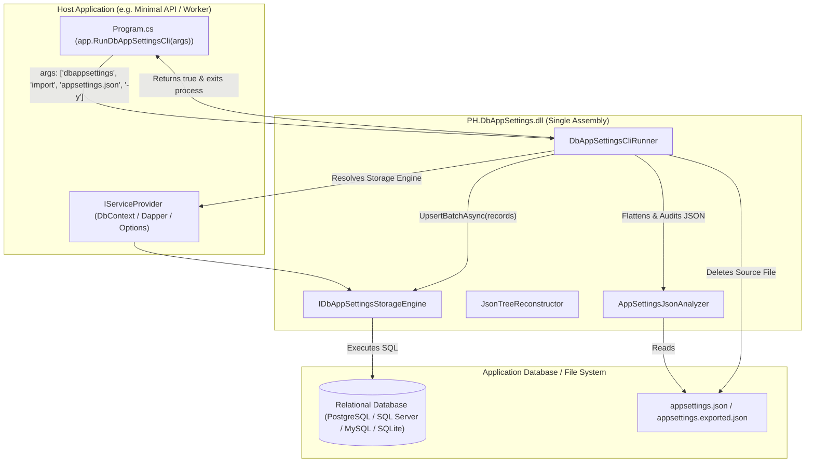

# 1. Purpose & Scope

This specification defines the complete technical design, implementation contracts, and test-driven development workflow for unifying the command-line interface (CLI) tooling directly into the core `PH.DbAppSettings` package.

### Scope Boundaries
- **In Scope**:
  - Porting `AppSettingsJsonAnalyzer`, `JsonTreeReconstructor`, and CLI data models (`FlattenedSettingItem`, `AppSettingsAnalysisResult`) into `PH.DbAppSettings.Cli` namespace inside `src/PH.DbAppSettings/`.
  - Implementing `DbAppSettingsCliRunner` in the core library to execute `analyze`, `import`, `ingest`, `export`, and `rewrite-json` subcommands using the host application's configured `IDbAppSettingsStorageEngine` and native `System.Console`.
  - Adding `RunDbAppSettingsCli` extension methods to `IHost` and `IServiceProvider` in `DbAppSettingsExtensions`.
  - Adding `build/PH.DbAppSettings.targets` to provide MSBuild invocation target `dotnet build /t:DbAppSettings /p:DbAppSettingsArgs="..."`.
  - Decommissioning and removing the separate `src/PH.DbAppSettings.Cli/` project from `PH.DbAppSettings.slnx`.
  - Updating all CLI unit/integration tests to run against the unified core assembly.
  - Updating `examples/PH.DbAppSettings.Example.MinimalApi` to demonstrate `if (app.RunDbAppSettingsCli(args)) return;`.
- **Out of Scope**:
  - Modifying the relational storage schema of the `AppSettings` table.
  - Adding external database driver packages (`Npgsql`, `Microsoft.Data.SqlClient`, `MySqlConnector`) to `PH.DbAppSettings.csproj`.

---

# 2. Domain Concepts & Ubiquitous Language

- **Embedded In-App CLI Runner (`DbAppSettingsCliRunner`)**: A command dispatcher embedded inside the core library that parses CLI arguments and executes management operations using the host application's registered DI services.
- **In-App CLI Interceptor (`RunDbAppSettingsCli`)**: An extension method called in `Program.cs` that intercepts command-line execution when arguments start with `dbappsettings`, performs the requested operation, and exits the process before the web server starts.
- **Single Assembly Distribution**: A distribution model where 100% of runtime configuration and CLI management features reside in a single `PH.DbAppSettings.dll` binary without requiring secondary packages.
- **Zero-Config Database Discovery**: The mechanism where the CLI runner automatically reuses the host application's registered `IDbAppSettingsStorageEngine` without requiring manual `-c <connectionString>` or `-d <dialect>` flags.

---

# 3. Architecture & Component Interaction



---

# 4. Data Contracts & Wire Formats

### 4.1 CLI Runner Public Interface
```csharp
namespace PH.DbAppSettings.Cli;

public static class DbAppSettingsCliRunner
{
    public const string CliPrefix = "dbappsettings";

    /// <summary>
    /// Executes a DbAppSettings CLI command against the provided service provider.
    /// Returns 0 on success, non-zero exit code on failure.
    /// </summary>
    public static Task<int> RunAsync(IServiceProvider services, string[] args, TextWriter? output = null, TextWriter? error = null, CancellationToken ct = default);
}
```

### 4.2 Extension Method Contracts
```csharp
namespace PH.DbAppSettings;

public static partial class DbAppSettingsExtensions
{
    /// <summary>
    /// Intercepts execution if command-line arguments match DbAppSettings CLI commands.
    /// Returns true if a CLI command was handled, prompting the host process to terminate.
    /// </summary>
    public static bool RunDbAppSettingsCli(this Microsoft.Extensions.Hosting.IHost host, string[] args);

    /// <summary>
    /// Intercepts execution if command-line arguments match DbAppSettings CLI commands using an IServiceProvider.
    /// </summary>
    public static bool RunDbAppSettingsCli(this IServiceProvider serviceProvider, string[] args);
}
```

---

# 5. Security, Secrets & Policy Invariants

1. **No External Driver Bloat**: `PH.DbAppSettings.csproj` must NEVER directly reference `Microsoft.Data.SqlClient`, `Npgsql`, or `MySqlConnector`. Database drivers are supplied by the consumer application.
2. **Zero Plaintext Secrets in Logs**: Sensitive values flagged by `AppSettingsJsonAnalyzer` must be masked with `***` in console outputs during `analyze` commands.
3. **Safe File Deletion**: During `ingest -y`, the source file is deleted ONLY after database persistence completes successfully.

---

# 6. Acceptance Criteria & Test Scenarios

### Scenario 1: `analyze` command parses JSON and masks secrets
- **Given** an `appsettings.json` file containing sensitive connection strings and passwords.
- **When** `DbAppSettingsCliRunner.RunAsync(sp, ["dbappsettings", "analyze", "appsettings.json"])` is invoked.
- **Then** the output contains a summary table of flattened keys with sensitive keys flagged, returning exit code `0`.
- *RED Phase Failure Mode*: `DbAppSettingsCliRunner` class does not exist in `PH.DbAppSettings.Cli`.

### Scenario 2: `import` command populates database using host's configured storage engine
- **Given** an in-memory or SQLite database configured in `IServiceProvider` with an empty `AppSettings` table.
- **When** `DbAppSettingsCliRunner.RunAsync(sp, ["dbappsettings", "import", "appsettings.json", "-e", "Production"])` is executed.
- **Then** all flattened keys from `appsettings.json` are present in the database table and exit code is `0`.
- *RED Phase Failure Mode*: `DbAppSettingsCliRunner.RunAsync` does not support `import` command or fails to resolve `IDbAppSettingsStorageEngine`.

### Scenario 3: `ingest` command imports and deletes source JSON file
- **Given** a temporary `appsettings.json` file and a valid `IServiceProvider`.
- **When** `DbAppSettingsCliRunner.RunAsync(sp, ["dbappsettings", "ingest", tempFile, "-y"])` is executed.
- **Then** the settings are in the database, the temporary file is deleted from disk, and exit code is `0`.
- *RED Phase Failure Mode*: `ingest` command fails or leaves source file on disk.

### Scenario 4: `rewrite-json` reconstructs typed JSON tree from database
- **Given** database containing hierarchical keys (`Application__Features__EnableCache = "true"`).
- **When** `DbAppSettingsCliRunner.RunAsync(sp, ["dbappsettings", "rewrite-json", "-o", "output.json"])` is executed.
- **Then** `output.json` contains valid typed JSON with boolean `true` and nested objects.
- *RED Phase Failure Mode*: `rewrite-json` command is unimplemented in unified runner.

### Scenario 5: `export` command exports raw database entries
- **Given** database containing configuration records.
- **When** `DbAppSettingsCliRunner.RunAsync(sp, ["dbappsettings", "export", "-o", "exported.json"])` is executed.
- **Then** `exported.json` is created with formatted array of records.
- *RED Phase Failure Mode*: `export` command is unimplemented.

### Scenario 6: Non-CLI arguments pass through cleanly
- **Given** standard application startup arguments (e.g. `["--urls", "http://localhost:5000"]`).
- **When** `host.RunDbAppSettingsCli(args)` is called.
- **Then** the method immediately returns `false` and does not alter console output or exit.
- *RED Phase Failure Mode*: `RunDbAppSettingsCli` method missing on `IHost`.

---

# 7. Test Automation Strategy

### Individual Test Verification Commands (RED / GREEN)
```bash
# Run CLI runner unit tests
dotnet test tests/PH.DbAppSettings.Tests/PH.DbAppSettings.Tests.csproj --filter-class DbAppSettingsCliRunnerTests
```

### Full Solution Verification Commands (REFACTOR)
```bash
# Run all tests across the solution
dotnet test PH.DbAppSettings.slnx

# Format code
dotnet format PH.DbAppSettings.slnx --verify-no-changes
```

---

# 8. Observability, Logging & Error Handling

- All CLI commands write human-readable formatted messages to standard output and errors to standard error.
- If an unhandled exception occurs (e.g. file not found or database unreachable), the runner prints the error message cleanly to standard error and returns non-zero exit code (`1` or `2`).

---

# 9. Non-Functional Requirements & Performance

- **Zero Additional Memory Overhead**: CLI parsing uses lightweight token iteration without heavyweight reflection.
- **Zero Transitive Package Bloat**: `PH.DbAppSettings` package remains under 4 MB without external database driver dependencies.
- **Execution Speed**: Command execution finishes within 100ms for standard configuration files (< 1000 keys).

---

# 10. Dependencies & Assembly Manifest

### Core Assembly Dependencies (`src/PH.DbAppSettings/PH.DbAppSettings.csproj`)
- `Dapper` (2.1.66)
- `Microsoft.EntityFrameworkCore` (10.*)
- `Microsoft.EntityFrameworkCore.Relational` (10.*)
- `Microsoft.EntityFrameworkCore.Sqlite` (10.*)
- `Microsoft.Extensions.Configuration` (10.*)
- `Microsoft.Extensions.DependencyInjection` (10.*)
- `Microsoft.Extensions.Options.ConfigurationExtensions` (10.*)
- `Microsoft.Extensions.Logging.Abstractions` (10.*)

### Decommissioned Dependencies (Deleted with `PH.DbAppSettings.Cli`)
- `Spectre.Console`
- `Spectre.Console.Cli`
- `Microsoft.Data.SqlClient` (isolated from core)
- `Npgsql` (isolated from core)
- `MySqlConnector` (isolated from core)

---

# 11. Task Breakdown (YAML TDD Triads)

```yaml
tasks:
  - id: "TASK-001"
    name: "Port CLI Models and Services into Core Assembly"
    steps:
      - phase: "RED"
        action: "Create tests/PH.DbAppSettings.Tests/UnifiedJsonAnalyzerTests.cs verifying AppSettingsJsonAnalyzer and JsonTreeReconstructor in PH.DbAppSettings.Cli namespace."
        expected_failure: "CS0246: The type or namespace name 'AppSettingsJsonAnalyzer' could not be found in 'PH.DbAppSettings.Cli'."
      - phase: "GREEN"
        action: "Port FlattenedSettingItem, AppSettingsAnalysisResult, AppSettingsJsonAnalyzer, and JsonTreeReconstructor into src/PH.DbAppSettings/Cli/."
      - phase: "REFACTOR"
        action: "Optimize JSON parsing with System.Text.Json Utf8JsonReader and verify all analyzer tests pass."

  - id: "TASK-002"
    name: "Implement DbAppSettingsCliRunner Core Dispatcher"
    steps:
      - phase: "RED"
        action: "Create tests/PH.DbAppSettings.Tests/DbAppSettingsCliRunnerTests.cs testing analyze, import, ingest, export, and rewrite-json subcommands."
        expected_failure: "CS0246: The type or namespace name 'DbAppSettingsCliRunner' could not be found."
      - phase: "GREEN"
        action: "Implement DbAppSettingsCliRunner in src/PH.DbAppSettings/Cli/DbAppSettingsCliRunner.cs with subcommands and console formatting."
      - phase: "REFACTOR"
        action: "Refactor subcommand dispatching and verify all CLI runner test cases pass cleanly."

  - id: "TASK-003"
    name: "Implement RunDbAppSettingsCli Extension Methods on IHost and IServiceProvider"
    steps:
      - phase: "RED"
        action: "Create tests/PH.DbAppSettings.Tests/CliExtensionHookTests.cs testing host interception and non-CLI argument passthrough."
        expected_failure: "CS1061: 'IHost' does not contain a definition for 'RunDbAppSettingsCli'."
      - phase: "GREEN"
        action: "Implement RunDbAppSettingsCli extension methods in src/PH.DbAppSettings/DbAppSettingsExtensions.cs."
      - phase: "REFACTOR"
        action: "Ensure clean argument parsing and verify tests pass."

  - id: "TASK-004"
    name: "Add MSBuild Targets and Decommission PH.DbAppSettings.Cli Project"
    steps:
      - phase: "RED"
        action: "Verify that PH.DbAppSettings.slnx builds and passes tests after removing PH.DbAppSettings.Cli project reference."
        expected_failure: "Build or test failure if any test still depends on obsolete project."
      - phase: "GREEN"
        action: "Create src/PH.DbAppSettings/build/PH.DbAppSettings.targets, delete src/PH.DbAppSettings.Cli/, and remove it from PH.DbAppSettings.slnx."
      - phase: "REFACTOR"
        action: "Run dotnet test PH.DbAppSettings.slnx and verify 100% green tests."

  - id: "TASK-005"
    name: "Update Minimal API Example, AGENTS.md, and Documentation"
    steps:
      - phase: "RED"
        action: "Verify example project runs and passes ExampleMinimalApiTests."
        expected_failure: "N/A"
      - phase: "GREEN"
        action: "Update examples/PH.DbAppSettings.Example.MinimalApi/Program.cs with if (app.RunDbAppSettingsCli(args)) return;, update README.md, AGENTS.md, and CHANGELOG.md."
      - phase: "REFACTOR"
        action: "Run dotnet format PH.DbAppSettings.slnx and dotnet test PH.DbAppSettings.slnx."
```

---

# 12. Risk Analysis & Mitigation

| Risk | Severity | Mitigation Strategy |
| :--- | :---: | :--- |
| **Command Line Argument Collisions** | Low | The CLI runner strictly matches `dbappsettings` as the first token or command prefix, ignoring standard ASP.NET Core flags (`--urls`, `--environment`). |
| **Missing Storage Engine Registration** | Medium | If `IDbAppSettingsStorageEngine` is not registered when `import` is run, the runner outputs a clear helpful error message guiding the user to configure `AddDbAppSettings`. |
| **Console Formatting on Non-ANSI Terminals** | Low | Native `System.Console` outputs standard text tables and fallback plain characters without requiring ANSI escape sequence support. |

---

# 13. Review & Verification Checklist

- [ ] All CLI features (`analyze`, `import`, `ingest`, `export`, `rewrite-json`) are available in `PH.DbAppSettings`.
- [ ] No database driver packages (`Npgsql`, `SqlClient`, `MySqlConnector`) are referenced in `PH.DbAppSettings.csproj`.
- [ ] Secondary project `PH.DbAppSettings.Cli` is completely removed from the solution.
- [ ] `PH.DbAppSettings.slnx` builds with 0 errors and 0 warnings.
- [ ] All unit and integration tests pass via `dotnet test PH.DbAppSettings.slnx`.
- [ ] Code is formatted via `dotnet format PH.DbAppSettings.slnx`.
- [ ] README.md, AGENTS.md, and CHANGELOG.md accurately document the in-app CLI runner and single-package architecture.
