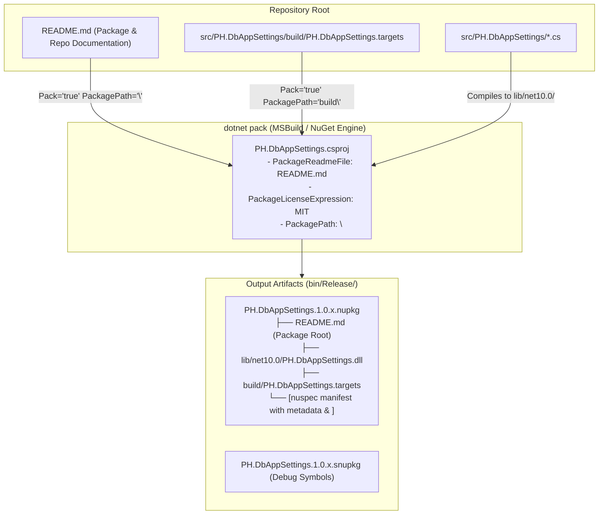

# 1. Purpose & Scope

This specification defines the exact MSBuild and NuGet packaging configuration required to publish the unified `PH.DbAppSettings` package to NuGet.org and private feeds in full compliance with official Microsoft NuGet authoring best practices.

### Scope Boundaries
- **In Scope**:
  - Configuring `PackageReadmeFile` MSBuild property pointing to `README.md`.
  - Packing the repository root `README.md` into the package root directory (`PackagePath="\"`).
  - Configuring standard Microsoft NuGet package metadata (`Authors`, `Company`, `Description`, `PackageLicenseExpression`, `PackageProjectUrl`, `RepositoryUrl`, `RepositoryType`, `PackageTags`, `PackageReleaseNotes`).
  - Configuring SourceLink and symbol packaging (`IncludeSymbols`, `SymbolPackageFormat`, `PublishRepositoryUrl`, `EmbedUntrackedSources`).
  - Verifying generated `.nupkg` archive structure and validating zero-warning `dotnet pack` output.
- **Out of Scope**:
  - Modifying C# configuration provider runtime code or database storage logic.
  - Setting up CI/CD GitHub Actions secret publishing keys (handled in deployment workflows).

---

# 2. Definitions & Terminology

| Term / Acronym | Definition |
| :--- | :--- |
| **`PackageReadmeFile`** | Official MSBuild property specifying the relative path of the Markdown documentation file within the `.nupkg` archive. |
| **`PackagePath`** | MSBuild metadata attribute on packed items determining their target relative location inside the `.nupkg` zip container. |
| **SPDX License Expression** | Standardized short identifier for open-source licenses (e.g. `MIT`, `Apache-2.0`) recognized by NuGet.org. |
| **SourceLink** | Tooling that enables debugging into NuGet package source code by linking compiled symbols directly to Git commits on GitHub. |
| **`snupkg`** | Standard NuGet symbol package format containing PDB debug symbols for indexed symbol servers. |

---

# 3. Requirements & Constraints

### 3.1 Functional Requirements

- **REQ-001**: `src/PH.DbAppSettings/PH.DbAppSettings.csproj` MUST declare `<PackageReadmeFile>README.md</PackageReadmeFile>`.
- **REQ-002**: `src/PH.DbAppSettings/PH.DbAppSettings.csproj` MUST pack the root `README.md` using `<None Include="..\..\README.md" Pack="true" PackagePath="\" />`.
- **REQ-003**: `PH.DbAppSettings.csproj` MUST declare `<PackageLicenseExpression>MIT</PackageLicenseExpression>`.
- **REQ-004**: `PH.DbAppSettings.csproj` MUST declare repository metadata:
  - `<RepositoryUrl>https://github.com/paonath/PH.DbAppSettings.git</RepositoryUrl>`
  - `<RepositoryType>git</RepositoryType>`
  - `<PackageProjectUrl>https://github.com/paonath/PH.DbAppSettings</PackageProjectUrl>`
- **REQ-005**: `PH.DbAppSettings.csproj` MUST declare `<Authors>Paolo Innocenti</Authors>` and `<Company>Paolo Innocenti</Company>`.
- **REQ-006**: `PH.DbAppSettings.csproj` MUST declare descriptive `<PackageTags>` encompassing configuration, database, EF Core, Dapper, SQL Server, PostgreSQL, SQLite, and MySQL.
- **REQ-007**: `PH.DbAppSettings.csproj` MUST declare `<IncludeSymbols>true</IncludeSymbols>` and `<SymbolPackageFormat>snupkg</SymbolPackageFormat>`.

### 3.2 Constraints & Prohibitions

- **CON-001**: Running `dotnet pack src/PH.DbAppSettings/PH.DbAppSettings.csproj` MUST NOT emit NuGet warning `NU5128`, `NU5039`, or missing readme warnings.
- **CON-002**: Tool dependencies MUST remain isolated and NOT be added to package `<dependencies>`.

---

# 4. Architecture & Interfaces



---

# 5. Dependencies & Integrations

### NuGet Packaging Properties Table

| MSBuild Property | Target Value | Description |
| :--- | :--- | :--- |
| `PackageId` | `PH.DbAppSettings` | Unique NuGet package identifier. |
| `PackageReadmeFile` | `README.md` | Points NuGet to the bundled markdown file for display on NuGet.org. |
| `PackageLicenseExpression` | `MIT` | Open source license expression. |
| `PackageProjectUrl` | `https://github.com/paonath/PH.DbAppSettings` | Project homepage. |
| `RepositoryUrl` | `https://github.com/paonath/PH.DbAppSettings.git` | Git repository URL. |
| `RepositoryType` | `git` | Repository source control system. |
| `Authors` | `Paolo Innocenti` | Author credits. |
| `Company` | `Paolo Innocenti` | Publisher organization. |
| `PackageTags` | `configuration;database;efcore;dapper;appsettings;options;sqlserver;postgresql;sqlite;mysql;cli` | Search tags on NuGet.org. |
| `IncludeSymbols` | `true` | Emits companion `.snupkg` for SourceLink. |
| `SymbolPackageFormat` | `snupkg` | Standard modern symbol format. |

---

# 6. Acceptance Criteria

- **AC-001 (Given/When/Then)**:
  - **Given** the `src/PH.DbAppSettings/PH.DbAppSettings.csproj` project configuration.
  - **When** `dotnet pack src/PH.DbAppSettings/PH.DbAppSettings.csproj -c Release` is executed.
  - **Then** the build completes with exit code `0` and ZERO warnings regarding missing readme or missing license.

- **AC-002 (Given/When/Then)**:
  - **Given** the generated `PH.DbAppSettings.*.nupkg` archive.
  - **When** the archive contents are inspected using zip utilities or `dotnet nuget verify`.
  - **Then** `README.md` exists at the root of the `.nupkg` archive.

- **AC-003 (Given/When/Then)**:
  - **Given** the generated `.nupkg` nuspec manifest.
  - **When** the `<metadata>` node is parsed.
  - **Then** `<readme>README.md</readme>` and `<license type="expression">MIT</license>` are present.

---

# 7. Test Automation Strategy

### Verification Commands

```bash
# 1. Clean previous release builds
dotnet clean src/PH.DbAppSettings/PH.DbAppSettings.csproj -c Release

# 2. Pack project and verify zero warnings
dotnet pack src/PH.DbAppSettings/PH.DbAppSettings.csproj -c Release --verbosity normal

# 3. Verify that README.md exists inside the generated .nupkg
unzip -l src/PH.DbAppSettings/bin/Release/PH.DbAppSettings.*.nupkg | grep -E "README.md|PH.DbAppSettings.targets"

# 4. Run full test suite across the solution
dotnet test PH.DbAppSettings.slnx
```

---

# 8. Examples & Edge Cases

### Concrete `.csproj` Configuration Example

```xml
<Project Sdk="Microsoft.NET.Sdk">

  <PropertyGroup>
    <TargetFramework>net10.0</TargetFramework>
    <ImplicitUsings>enable</ImplicitUsings>
    <Nullable>enable</Nullable>
    
    <!-- Package Identification & Authoring -->
    <PackageId>PH.DbAppSettings</PackageId>
    <Authors>Paolo Innocenti</Authors>
    <Company>Paolo Innocenti</Company>
    <Description>High-performance .NET 10 database configuration provider with embedded CLI tools supporting EF Core and Dapper across PostgreSQL, SQL Server, MySQL, and SQLite.</Description>
    <PackageTags>configuration;database;efcore;dapper;appsettings;options;sqlserver;postgresql;sqlite;mysql;cli</PackageTags>
    <PackageLicenseExpression>MIT</PackageLicenseExpression>
    
    <!-- Links & Source Control -->
    <PackageProjectUrl>https://github.com/paonath/PH.DbAppSettings</PackageProjectUrl>
    <RepositoryUrl>https://github.com/paonath/PH.DbAppSettings.git</RepositoryUrl>
    <RepositoryType>git</RepositoryType>
    <PublishRepositoryUrl>true</PublishRepositoryUrl>
    <EmbedUntrackedSources>true</EmbedUntrackedSources>
    
    <!-- Documentation & Readme -->
    <PackageReadmeFile>README.md</PackageReadmeFile>
    
    <!-- Symbols -->
    <IncludeSymbols>true</IncludeSymbols>
    <SymbolPackageFormat>snupkg</SymbolPackageFormat>
  </PropertyGroup>

  <ItemGroup>
    <!-- Include root README.md directly into NuGet package root -->
    <None Include="..\..\README.md" Pack="true" PackagePath="\" />
    <None Include="build\PH.DbAppSettings.targets" Pack="true" PackagePath="build\" />
  </ItemGroup>

  <!-- Compile-time references only -->
  <ItemGroup>
    <PackageReference Include="Dapper" Version="2.1.66" />
    <PackageReference Include="Microsoft.EntityFrameworkCore" Version="10.*-*" />
    <PackageReference Include="Microsoft.EntityFrameworkCore.Design" Version="10.*-*">
      <IncludeAssets>runtime; build; native; contentfiles; analyzers; buildtransitive</IncludeAssets>
      <PrivateAssets>all</PrivateAssets>
    </PackageReference>
    <PackageReference Include="Microsoft.EntityFrameworkCore.Relational" Version="10.*-*" />
    <PackageReference Include="Microsoft.EntityFrameworkCore.Sqlite" Version="10.*-*" />
    <PackageReference Include="Microsoft.Extensions.Configuration" Version="10.*-*" />
    <PackageReference Include="Microsoft.Extensions.Configuration.Abstractions" Version="10.*-*" />
    <PackageReference Include="Microsoft.Extensions.Configuration.Binder" Version="10.*-*" />
    <PackageReference Include="Microsoft.Extensions.Configuration.FileExtensions" Version="10.*-*" />
    <PackageReference Include="Microsoft.Extensions.Configuration.Json" Version="10.*-*" />
    <PackageReference Include="Microsoft.Extensions.DependencyInjection" Version="10.*-*" />
    <PackageReference Include="Microsoft.Extensions.Hosting.Abstractions" Version="10.*-*" />
    <PackageReference Include="Microsoft.Extensions.Logging.Abstractions" Version="10.*-*" />
    <PackageReference Include="Microsoft.Extensions.Options.ConfigurationExtensions" Version="10.*-*" />
  </ItemGroup>

</Project>
```

---

# 9. Spec Validation & AI-Readiness

- [X] Use unambiguous language without idioms.
- [X] Define all acronyms and terms in section 2.
- [X] Use MUST/SHALL/SHOULD/MAY keywords for requirements.
- [X] Define measurable acceptance criteria.
- [X] Ensure self-contained context without unstated assumptions.
- [X] Structure machine-readable output with headings, lists, tables, code blocks.
- [X] Independent and atomic task granularity.
- [X] Comply with `.agents/rules/markdown-style-ai.md`.
- [X] Include visual Mermaid diagram for package creation flow.

---

# 10. References & Instructions

- Microsoft NuGet Documentation: `https://learn.microsoft.com/en-us/nuget/nuget-org/package-readme-on-nuget-org`
- Microsoft MSBuild Pack Properties: `https://learn.microsoft.com/en-us/dotnet/core/tools/csproj#nuget-metadata-properties`
- Project Instructions: `.agents/rules/nuget-manager.md`, `.agents/rules/dotnet-cli-usage.md`, `AGENTS.md`

---

# 11. Task Breakdown

```yaml
tasks:
  - id: "TASK-001"
    title: "Configure PackageReadmeFile and Root README.md Item in PH.DbAppSettings.csproj"
    type: "code"
    priority: "critical"
    estimated_effort: "small"
    dependencies: []
    objective: |
      Add PackageReadmeFile property pointing to README.md and include None item mapping ..\..\README.md to PackagePath="\" in src/PH.DbAppSettings/PH.DbAppSettings.csproj.
    preconditions:
      - "Root README.md exists and is up to date."
    acceptance_criteria:
      - "PackageReadmeFile is declared in PropertyGroup."
      - "None item maps ..\..\README.md to PackagePath=\"\\\"."
    files_to_create: []
    files_to_modify:
      - path: "src/PH.DbAppSettings/PH.DbAppSettings.csproj"
        reason: "Add PackageReadmeFile and None item."
    validation:
      - "dotnet pack src/PH.DbAppSettings/PH.DbAppSettings.csproj -c Release"

  - id: "TASK-002"
    title: "Configure Full Package Metadata and SourceLink Symbols"
    type: "code"
    priority: "high"
    estimated_effort: "small"
    dependencies: ["TASK-001"]
    objective: |
      Add Authors, Company, PackageLicenseExpression, PackageProjectUrl, RepositoryUrl, RepositoryType, PackageTags, IncludeSymbols, and SymbolPackageFormat to PH.DbAppSettings.csproj.
    preconditions:
      - "TASK-001 completed."
    acceptance_criteria:
      - "All metadata fields present in PropertyGroup."
      - "dotnet pack generates both .nupkg and .snupkg without warnings."
    files_to_modify:
      - path: "src/PH.DbAppSettings/PH.DbAppSettings.csproj"
        reason: "Add metadata and symbol properties."
    validation:
      - "dotnet pack src/PH.DbAppSettings/PH.DbAppSettings.csproj -c Release"
      - "unzip -l src/PH.DbAppSettings/bin/Release/PH.DbAppSettings.*.nupkg | grep README.md"

  - id: "TASK-003"
    title: "Verify End-to-End Pack and Test Suite"
    type: "validation"
    priority: "medium"
    estimated_effort: "small"
    dependencies: ["TASK-002"]
    objective: |
      Execute full solution build, pack, and test suite to verify 100% green tests and zero packaging warnings.
    acceptance_criteria:
      - "dotnet pack succeeds with zero warnings."
      - "dotnet test PH.DbAppSettings.slnx passes 100%."
    validation:
      - "dotnet test PH.DbAppSettings.slnx"
```

---

# 12. Conflict Detection

- **Conflict Check**: No conflicts found with existing specifications in `/specs/implemented/`.
- **Relationship**: Directly extends `010_spec-tdd-unified-single-package-cli.md` by defining the packaging metadata and documentation distribution for the unified package.

---

# 13. Files Added to Context

- `src/PH.DbAppSettings/PH.DbAppSettings.csproj`
- `README.md`
- `AGENTS.md`
- `specs/implemented/010_spec-tdd-unified-single-package-cli.md`
