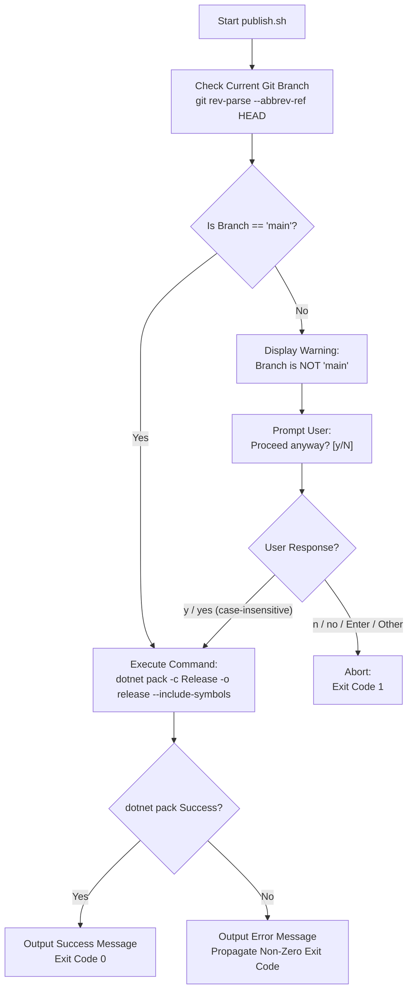

# 1. Purpose & Scope

This specification defines the requirements, architecture, and behavior of a repository root publishing script (`publish.sh`) that automates creating release NuGet packages while guarding against unintended builds on non-main git branches.

### Scope Boundaries
- **In Scope**:
  - Script placement at the repository root directory (`publish.sh`).
  - Active Git branch detection using native Git CLI commands.
  - Branch validation logic ensuring automatic progression only on `main`.
  - User warning and interactive confirmation prompt when executing on any branch other than `main`.
  - Default rejection behavior (`n`/`no`) when pressing Enter or submitting empty/invalid inputs.
  - Execution of `dotnet pack -c Release -o release --include-symbols` upon branch confirmation or on `main`.
  - Companion PowerShell script (`publish.ps1`) for cross-platform Windows environments.
  - Execution permissions and shell safety flags (`set -euo pipefail`).
- **Out of Scope**:
  - Direct upload or pushing of packages to remote NuGet feeds (`dotnet nuget push`).
  - Modifying project packaging metadata or source code files.
  - Modifying `version.json` or Nerdbank.GitVersioning configurations.

---

# 2. Definitions & Terminology

| Term / Acronym | Definition |
| :--- | :--- |
| **`publish.sh`** | Primary POSIX Bash automation script located at repository root. |
| **`publish.ps1`** | Optional Windows PowerShell companion automation script located at repository root. |
| **`main`** | Default production branch of the repository designated for official public releases. |
| **`dotnet pack`** | .NET CLI command that builds the project and creates NuGet `.nupkg` and `.snupkg` packages. |
| **`release/`** | Target directory at repository root where generated package artifacts are emitted. |
| **`IncludeSymbols`** | Packaging parameter that generates companion `.snupkg` symbol packages for debugging. |

---

# 3. Requirements & Constraints

### 3.1 Functional Requirements

- **REQ-001**: The primary publishing script MUST be located at `publish.sh` in the repository root directory.
- **REQ-002**: A companion PowerShell script `publish.ps1` SHOULD be located in the repository root directory for Windows environments.
- **REQ-003**: The script MUST detect the current Git branch using `git rev-parse --abbrev-ref HEAD` or `git branch --show-current`.
- **REQ-004**: If the active branch is `main`, the script MUST immediately proceed to execute the packaging command without interactive prompting.
- **REQ-005**: If the active branch is NOT `main` (including detached HEAD state), the script MUST display a prominent warning to the user indicating the current branch name.
- **REQ-006**: When not on `main`, the script MUST prompt the user for confirmation with prompt format `Proceed anyway? [y/N]: `.
- **REQ-007**: The confirmation prompt MUST default to `n` (rejection) if the user submits an empty line or enters any value other than `y` / `yes` (case-insensitive).
- **REQ-008**: If the user confirms with `y` or `yes` (case-insensitive), the script MUST proceed to execute the packaging command.
- **REQ-009**: If the user declines with `n`, `no`, or default, the script MUST abort execution and terminate with exit code `1`.
- **REQ-010**: When proceeding, the script MUST execute the exact command:
  ```bash
  dotnet pack -c Release -o release --include-symbols
  ```
- **REQ-011**: The script MUST propagate the exit status of the `dotnet pack` command upon completion.

### 3.2 Constraints & Prohibitions

- **CON-001**: The script MUST NOT suppress errors silently; bash scripts MUST use `set -euo pipefail`.
- **CON-002**: The script MUST NOT push packages to remote repositories or execute destructive git commands.
- **CON-003**: The script MUST work in standard POSIX / macOS / Linux environments with Bash 3.2+.

---

# 4. Architecture & Interfaces

The script coordinates git branch inspection, user interaction, and .NET CLI package building.



---

# 5. Dependencies & Integrations

### Runtime & System Dependencies

| Dependency | Purpose | Minimum Version |
| :--- | :--- | :--- |
| **Bash** | Script execution shell (`publish.sh`) | Bash 3.2+ |
| **PowerShell** | Script execution shell on Windows (`publish.ps1`) | 5.1+ / Core 7+ |
| **Git CLI** | Querying active branch information | Git 2.0+ |
| **.NET SDK** | Building solution and creating NuGet packages | .NET SDK 10.0+ |

### Execution Parameters Table

| Argument / Flag | Value | Purpose |
| :--- | :--- | :--- |
| `Configuration` | `-c Release` | Compiles optimized release binaries. |
| `Output Directory` | `-o release` | Places `.nupkg` and `.snupkg` artifacts into `./release/`. |
| `Include Symbols` | `--include-symbols` | Emits companion symbol package (`.snupkg`). |

---

# 6. Acceptance Criteria

- **AC-001 (Given/When/Then)**:
  - **Given** the repository is on branch `main`.
  - **When** `./publish.sh` is executed.
  - **Then** the script executes `dotnet pack -c Release -o release --include-symbols` without prompting and exits with code `0`.

- **AC-002 (Given/When/Then)**:
  - **Given** the repository is on a non-main branch (e.g. `feature/script_for_publish`).
  - **When** `./publish.sh` is executed and the user inputs `y` or `yes`.
  - **Then** the script displays a warning, receives confirmation, executes `dotnet pack -c Release -o release --include-symbols`, and exits with code `0`.

- **AC-003 (Given/When/Then)**:
  - **Given** the repository is on a non-main branch.
  - **When** `./publish.sh` is executed and the user presses Enter (empty input) or enters `n` / `no`.
  - **Then** the script displays a warning, aborts without running `dotnet pack`, and exits with code `1`.

- **AC-004 (Given/When/Then)**:
  - **Given** `publish.sh` in repository root.
  - **When** file permissions are checked.
  - **Then** the script has executable permissions (`chmod +x publish.sh`).

---

# 7. Test Automation Strategy

### Automated & Manual Verification Commands

```bash
# 1. Verify executable permissions on publish.sh
test -x ./publish.sh && echo "Executable bit set"

# 2. Test abort on non-main branch via piped standard input (default 'n')
echo "" | ./publish.sh
test $? -eq 1 && echo "Abort test passed"

# 3. Test explicit rejection on non-main branch
echo "n" | ./publish.sh
test $? -eq 1 && echo "Rejection test passed"

# 4. Test explicit confirmation on non-main branch
echo "y" | ./publish.sh
test $? -eq 0 && echo "Confirmation pack test passed"

# 5. Verify generated packages in release folder
ls -la release/*.nupkg release/*.snupkg
```

---

# 8. Examples & Edge Cases

### Concrete `publish.sh` Implementation Reference

```bash
#!/usr/bin/env bash
set -euo pipefail

# Ensure script is executed from the repository root
SCRIPT_DIR="$(cd "$(dirname "${BASH_SOURCE[0]}")" && pwd)"
cd "${SCRIPT_DIR}"

# Check if git is available
if ! command -v git >/dev/null 2>&1; then
    echo "ERROR: 'git' command not found in PATH." >&2
    exit 1
fi

# Detect current git branch
CURRENT_BRANCH="$(git rev-parse --abbrev-ref HEAD 2>/dev/null || echo "")"

if [ -z "${CURRENT_BRANCH}" ]; then
    echo "ERROR: Unable to determine Git branch. Is this a Git repository?" >&2
    exit 1
fi

echo "==> Current Git branch: ${CURRENT_BRANCH}"

if [ "${CURRENT_BRANCH}" != "main" ]; then
    echo ""
    echo "WARNING: You are on branch '${CURRENT_BRANCH}', not 'main'."
    echo "Publishing from a non-main branch may generate prerelease or development packages."
    echo ""
    read -r -p "Do you want to proceed with packaging anyway? [y/N]: " RESPONSE
    RESPONSE="$(echo "${RESPONSE}" | tr '[:upper:]' '[:lower:]')"
    
    if [ "${RESPONSE}" != "y" ] && [ "${RESPONSE}" != "yes" ]; then
        echo "==> Packaging aborted by user."
        exit 1
    fi
fi

echo ""
echo "==> Executing: dotnet pack -c Release -o release --include-symbols"
dotnet pack -c Release -o release --include-symbols

echo ""
echo "==> Packaging completed successfully. Artifacts available in ./release/"
```

### Concrete `publish.ps1` Implementation Reference

```powershell
[CmdletBinding()]
param()

$ErrorActionPreference = "Stop"

$scriptDir = Split-Path -Parent $MyInvocation.MyCommand.Path
Set-Location $scriptDir

if (-not (Get-Command git -ErrorAction SilentlyContinue)) {
    Write-Error "'git' command not found in PATH."
    exit 1
}

$currentBranch = (git rev-parse --abbrev-ref HEAD).Trim()
Write-Host "==> Current Git branch: $currentBranch" -ForegroundColor Cyan

if ($currentBranch -ne "main") {
    Write-Warning "You are on branch '$currentBranch', not 'main'."
    Write-Warning "Publishing from a non-main branch may generate prerelease or development packages."
    
    $response = Read-Host "Do you want to proceed with packaging anyway? [y/N]"
    $response = $response.Trim().ToLowerInvariant()
    
    if ($response -ne "y" -and $response -ne "yes") {
        Write-Host "==> Packaging aborted by user." -ForegroundColor Yellow
        exit 1
    }
}

Write-Host "`n==> Executing: dotnet pack -c Release -o release --include-symbols" -ForegroundColor Green
dotnet pack -c Release -o release --include-symbols

if ($LASTEXITCODE -ne 0) {
    Write-Error "dotnet pack failed with exit code $LASTEXITCODE"
    exit $LASTEXITCODE
}

Write-Host "`n==> Packaging completed successfully. Artifacts available in ./release/" -ForegroundColor Green
```

### Edge Cases
- **Detached HEAD**: `git rev-parse --abbrev-ref HEAD` outputs `HEAD`. Treated as non-main and prompts for confirmation.
- **Non-interactive / CI Execution**: Input streams piped without data default to `n` preventing accidental unconfirmed packaging in automated environments.
- **Case Variations**: User inputs `Y`, `Yes`, `YES`, `yEs` are normalized to lowercase and accepted.

---

# 9. Spec Validation & AI-Readiness

- [X] Use unambiguous language without idioms.
- [X] Define all acronyms and terms in section 2.
- [X] Use MUST/SHALL/SHOULD/MAY keywords for requirements.
- [X] Define measurable acceptance criteria.
- [X] Ensure self-contained context without unstated assumptions.
- [X] Structure machine-readable output with headings, lists, tables, code blocks.
- [X] Independent and atomic task granularity.
- [X] Comply with `.agents/rules/markdown-style-ai.md`.
- [X] Include visual Mermaid flowchart for branch validation logic.

---

# 10. References & Instructions

- Project Instructions: `AGENTS.md`, `.agents/rules/dotnet-cli-usage.md`, `.agents/rules/git-commit-conventions.md`
- Microsoft .NET Pack Reference: `https://learn.microsoft.com/en-us/dotnet/core/tools/dotnet-pack`
- Related Specifications: `specs/implemented/011_spec-infrastructure-nuget-package-metadata-and-readme-bundling.md`

---

# 11. Task Breakdown

```yaml
tasks:
  - id: "TASK-001"
    title: "Create publish.sh Root Automation Script with Git Branch Guard"
    type: "tool"
    priority: "critical"
    estimated_effort: "small"
    dependencies: []
    objective: |
      Create the publish.sh bash script in repository root implementing git branch detection, non-main warning with [y/N] confirmation, and dotnet pack execution.
    preconditions:
      - "Git CLI and .NET 10 SDK installed."
    acceptance_criteria:
      - "publish.sh exists in repository root."
      - "publish.sh has executable permissions (chmod +x)."
      - "Checks current branch and prompts if not main."
      - "Executes dotnet pack -c Release -o release --include-symbols on confirmation or main."
    files_to_create:
      - path: "publish.sh"
        reason: "Root publishing script."
    validation:
      - "chmod +x publish.sh"
      - "echo 'n' | ./publish.sh"
      - "echo 'y' | ./publish.sh"

  - id: "TASK-002"
    title: "Create publish.ps1 Companion PowerShell Script"
    type: "tool"
    priority: "medium"
    estimated_effort: "small"
    dependencies: ["TASK-001"]
    objective: |
      Create the publish.ps1 PowerShell script in repository root mirroring publish.sh logic for Windows environments.
    preconditions:
      - "TASK-001 specification completed."
    acceptance_criteria:
      - "publish.ps1 exists in repository root."
      - "Prompts with default N on non-main branch."
      - "Executes dotnet pack -c Release -o release --include-symbols on confirmation or main."
    files_to_create:
      - path: "publish.ps1"
        reason: "Windows companion publishing script."
    validation:
      - "pwsh -File ./publish.ps1 -?"

  - id: "TASK-003"
    title: "Verify End-to-End Packaging Output and Integration"
    type: "validation"
    priority: "high"
    estimated_effort: "small"
    dependencies: ["TASK-001", "TASK-002"]
    objective: |
      Run the script, confirm execution on feature branch, and verify that package artifacts (.nupkg and .snupkg) are generated in the release/ folder.
    acceptance_criteria:
      - "release/ directory contains generated .nupkg and .snupkg packages."
      - "Zero packaging warnings emitted."
    validation:
      - "ls -la release/"
```

---

# 12. Conflict Detection

- **Conflict Check**: No conflicts found with existing specifications in `/specs/implemented/`.
- **Relationship**: Complements `011_spec-infrastructure-nuget-package-metadata-and-readme-bundling.md` by automating package artifact generation into `./release/` guarded by git branch checks.

---

# 13. Files Added to Context

- `specs/implemented/011_spec-infrastructure-nuget-package-metadata-and-readme-bundling.md`
- `AGENTS.md`
- `version.json`
- `Directory.Build.props`
